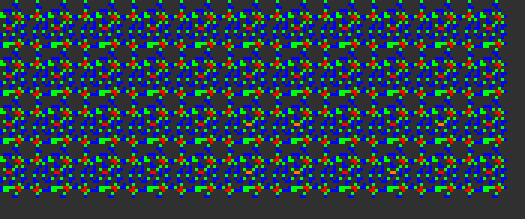
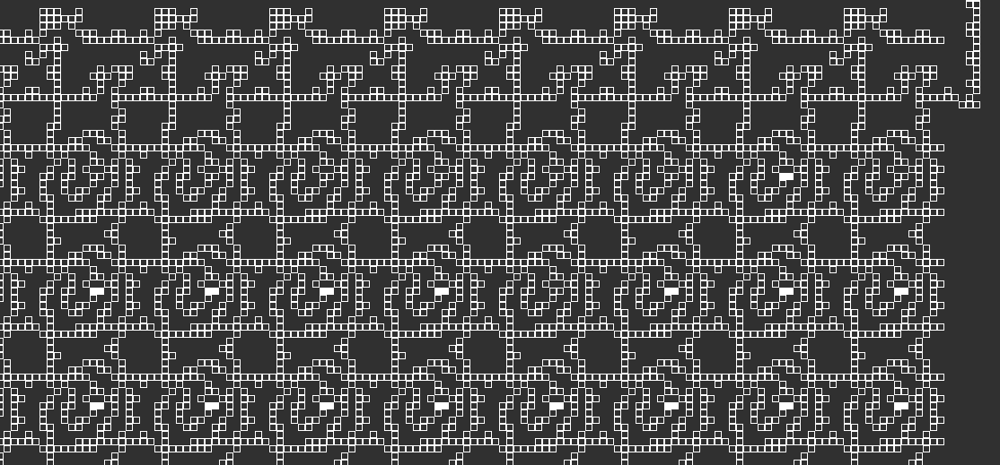

# Lisp in Conway's Game of Life

It's not Conway's Game of Life implemented in Lisp - it's a Lisp interpreter implemented in Conway's Game of Life.

The entire pattern is viewable on the browser [here]().


## Running Lisp and C on the Game of Life
This repository contains a Conway's Game of Life pattern that runs a Lisp interpreter.
The pattern is configurable and can load and run your own lisp code up to 1000 characters.
The program is loaded into the pattern by writing the ASCII representation of the program into the pattern's RAM module,
expressed by editing certain cells in the pattern.
The Lisp implementation supports lexical closures and macros, allowing one to write Lisp programs in a Lisp-like taste, as far as the memory limit allows you to.

The architecture is based on the computer used in the [Quest For Tetris](https://codegolf.stackexchange.com/questions/11880/build-a-working-game-of-tetris-in-conways-game-of-life) (QFT) project.
The [Lisp interpreter](./src/lisp.c), written in C, is compiled using [ELVM](https://github.com/shinh/elvm) (the Esoteric Language Virtual Machine)
(I implemented the Game of Life backend for ELVM myself for this project.
The backend is further modified (available in the submodule) for supporting QFT-specific optimizations.)

Using the toolchains in this project, you can compile any C code compatible with C11 and run in on Conway's Game of Life.
I've also included a build system for compiling a Hello World program that also finds prime numbers ([hello.c](./misc/hello/hello.c)) to the Game of Life,
accessible by `make hello`.
This build system can be used to compile more general C programs of your own.


## Screenshots


An animation of the RAM module of the QFT computer in the VarLife rule, while it is running.
The colors of the cells represent the 8 distinct states of the VarLife rule.



The QFT computer showing the results of the computation of the following code:

```lisp
(print (* 3 14))
```

The result is `42`, shown in binary ascii format (0b110100, 0b110010), read in bottom-to-up order.



The RAM module of the QFT computer converted to a Conway's Game of Life pattern while running. Each "cell" visible here is actually an [OTCA metapixel](https://www.conwaylife.com/wiki/OTCA_metapixel) (OTCAMP) zoomed far away.


## Pattern Files and Stats
| Program                                                | VarLife Pattern                                                       | Conway's Game of Life Pattern                                                                    |
|--------------------------------------------------------|-----------------------------------------------------------------------|--------------------------------------------------------------------------------------------------|
| [print.lisp](print.lisp)                               | [QFT_print.mc](./patterns/QFT_print.mc)                               | [QFT_print_metafied.mc](./patterns/metafied/QFT_print_metafied.mc)                               |
| [object-oriented-like.lisp](object-oriented-like.lisp) | [QFT_object-oriented-like.mc](./patterns/QFT_object-oriented-like.mc) | [QFT_object-oriented-like_metafied.mc](./patterns/metafied/QFT_object-oriented-like_metafied.mc) |
| [z-combinator.lisp](z-combinator.lisp)                 | [QFT_z-combinator.mc](./patterns/QFT_z-combinator.mc)                 | [QFT_z-combinator_metafied.mc](./patterns/metafied/QFT_z-combinator_metafied.mc)                 |
| [backquote-splice.lisp](backquote-splice.lisp)         | [QFT_backquote-splice.mc](./patterns/QFT_backquote-splice.mc)         | [QFT_backquote-splice_metafied.mc](./patterns/metafied/QFT_backquote-splice_metafied.mc)         |
| [backquote.lisp](backquote.lisp)                       | [QFT_backquote.mc](./patterns/QFT_backquote.mc)                       | [QFT_backquote_metafied.mc](./patterns/metafied/QFT_backquote_metafied.mc)                       |
| [primes-print.lisp](primes-print.lisp)                 | [QFT_primes-print.mc](./patterns/QFT_primes-print.mc)                 | [QFT_primes-print_metafied.mc](./patterns/metafied/QFT_primes-print_metafied.mc)                 |
| [primes.lisp](primes.lisp)                             | [QFT_primes.mc](./patterns/QFT_primes.mc)                             | [QFT_primes_metafied.mc](./patterns/metafied/QFT_primes_metafied.mc)                             |

Pattern files preloaded with various Lisp programs are available here. For details on each Lisp program, please see the Sample Lisp Programs section.

The patterns can be simulted on the Game of Life simulator [Golly](https://en.wikipedia.org/wiki/Golly_(program)).
VarLife patterns can be simulated on Golly as well.
Details on VarLife are explained in the next section.
To run the VarLife patterns on Golly, additional settings are required. Please see [build.md](./build.md) for a detailed description.


### Descriptions of the Lisp Programs

- **object-oriented-like.lisp**:
    This example demonstrates the construction of a structure similar to classes in Object-Oriented Programming, using closures.

    - The class has named methods and field variables, where each instance carries distinct and persistent memory locations of their own.
    The example instantiates two counters and concurrently modifies the value held by each instance.
    - New syntaxes for instantiation and method access (`(new classname)` and `(. instance methodname)`) are introduced using macros and functions.

    The Lisp interpreter's variable scope of closures and the macro functionalities is powerful enough to manage complex memory management,
    and even providing a new syntax to support the target paradigm.

- **z-combinator.lisp**:
Demonstration of the [Z Combinator](https://en.wikipedia.org/wiki/Fixed-point_combinator#Strict_fixed-point_combinator) to implement a factorial function
using [anonymous recursion](https://en.wikipedia.org/wiki/Anonymous_recursion).

- **backquote-splice.lisp**:
Implements the [backquote macro](http://cl-cookbook.sourceforge.net/macros.html#LtohTOCentry-2) used commonly in Lisp to construct macros.
The macro also supports the unquote and unquote-splice operations, each written as `~` and `~@`.

- **primes.lisp**: Prints a list of prime numbers up to 20. This example highlights the use of the `while` syntax.


The contents of print.lisp is quite straightforward.
backquote.lisp and primes-print.lisp are similar to backquote-splice.lisp and primes.lisp, mainly included for performance comparisons.
backquote.lisp doesn't implement the unquote-splice operation, and demonstrates some more examples.
primes-print.lisp reduces the number of list operations to save memory usage.


### What is VarLife?
VarLife is an 8-state cellular automaton defined in the [Quest For Tetris](https://codegolf.stackexchange.com/questions/11880/build-a-working-game-of-tetris-in-conways-game-of-life) (QFT) Project.
It is used as an intermediate layer to generate the final Conway's Game of Life pattern;
the computer is first created in VarLife, and then converted to a Game of Life pattern.

When converting VarLife to Game of Life, each VarLife cell is mapped to an [OTCA Metapixel](https://www.conwaylife.com/wiki/OTCA_metapixel) (OTCAMP).
The OTCA Metapixel is a special pattern that is capable of emulating a different game-of-life-like rule within the Game of Life.
Each cell carries a binary meta-state and a pre-programmed rule.
The conversion from VarLife to the Game of Life is done in a way so that the behavior of the states and generations of the VarLife pattern
matches exactly with the converted Game of Life pattern's meta-states and meta-generations.
Therefore, it is enough to verify the behavior of the VarLife pattern to verify the behavior of the Game of Life pattern.


### Running Times for the Varlife Patterns
| Program                                                | #QFT CPU Cycles | QFT Memory Usage | #Halting Generations (VarLife) | Running Time (VarLife) | Memory Usage (VarLife) |
|--------------------------------------------------------|-----------------|------------------|--------------------------------|------------------------|------------------------|
| [print.lisp](print.lisp)                               |           4,425 |         92 bytes |            105,413,068 (exact) |             1.159 mins |                5.0 GiB |
| [z-combinator.lisp](z-combinator.lisp)                 |          58,883 |        544 bytes |          1,700,000,000         |             9.823 mins |               23.4 GiB |
| [backquote-splice.lisp](backquote-splice.lisp)         |         142,353 |        869 bytes |          4,100,000,000         |            20.467 mins |               27.5 GiB |
| [backquote.lisp](backquote.lisp)                       |         142,742 |        876 bytes |          4,100,000,000         |            21.663 mins |               27.5 GiB |
| [object-oriented-like.lisp](object-oriented-like.lisp) |         161,843 |        838 bytes |          4,673,000,000         |            22.312 mins |               27.5 GiB |
| [primes-print.lisp](primes-print.lisp)                 |         281,883 |        527 bytes |          8,880,000,000         |            27.543 mins |               27.5 GiB |
| [primes.lisp](primes.lisp)                             |         304,964 |        943 bytes |          9,607,100,000         |            38.334 mins |               27.5 GiB |


The running times for each program are shown above.
The [Hashlife](https://en.wikipedia.org/wiki/Hashlife) algorithm used for the simulation requires a lot of memory in exchange of speedups.
The simulations were run on a 32GB-RAM computer, with Golly's memory usage limit set to 28000 MB, and the default base step to 2 (configurable from the preferences).
The memory usage was measured by Ubuntu's activity monitor.
The number of CPU cycles and the QFT memory usage was obtained by running QFTASM interpreter on the host PC.

After the program counter reaches 65535 and the program exits, no more signals become read from both the ROM and the RAM,
which eventually makes the VarLife pattern becomes completely stationary, where every pattern after a given timestep becomes completely identical.

Defining this as the halting time for the calculation, the pattern for [print.lisp](print.lisp) halts at exactly 105,413,068 VarLife generations.
By generation 105,387,540, the value 65535 gets written to the program counter.
At generation 105,413,067, the last signal becomes just one step from disappearing,
and at generation 105,413,068 and onwards, every pattern becomes identical to each other.

This gives a rate of 23822.16 generations required per CPU cycle.
However, this rate is slightly insufficient for the pattern for [z-combinator.lisp](z-combinator.lisp) to finish running (at generation 1,402,720,248).
The z-combinator outputs its results by generation 1,700,000,000, giving a rate of roughly 28870.81 generations required per CPU cycle.
This rate works for other patterns such as the patterns for [backquote-splice.lisp](backquote-splice.lisp) and [object-oriented-like.lisp](object-oriented-like.lisp).
However, this rate was insufficient for [primes-print.lisp](primes-print.lisp), where 8,137,000,000 generations was not enough to finish running, and required 8,880,000,000 generations to finish running,
with a rate of 31502.43 generations per CPU cycle.


### Running Times and Stats for the Conway's Game of Life Patterns
| Program                                                | #QFT CPU Cycles | QFT Memory Usage | #Halting Generations (GoL) | Running Time (GoL) | Memory Usage (GoL) |
|--------------------------------------------------------|-----------------|------------------|----------------------------|--------------------|--------------------|
| [print.lisp](print.lisp)                               |           4,425 |         92 bytes |  3,724,032,866,304 (exact) |                    |                    |
| [z-combinator.lisp](z-combinator.lisp)                 |          58,883 |        544 bytes |                         -  |                 -  |                  - |
| [backquote-splice.lisp](backquote-splice.lisp)         |         142,353 |        869 bytes |                         -  |                 -  |                  - |
| [backquote.lisp](backquote.lisp)                       |         142,742 |        876 bytes |                         -  |                 -  |                  - |
| [object-oriented-like.lisp](object-oriented-like.lisp) |         161,843 |        838 bytes |                         -  |                 -  |                  - |
| [primes-print.lisp](primes-print.lisp)                 |         281,883 |        527 bytes |                         -  |                 -  |                  - |
| [primes.lisp](primes.lisp)                             |         304,964 |        943 bytes |                         -  |                 -  |                  - |

The running times for the Conway's Game of Life Patterns is shown above.

Since one OTCA Metapixel is 2048 pixels wide and high, this makes the converted Life pattern expand 2048 times larger from the VarLife pattern.
Therefore, running the Game of Life (GoL) version is significantly slower than running the VarLife version.

Since the OTCA Metapixel has a phase of 35,328 (according to [LifeWiki - OTCA metapixel](https://www.conwaylife.com/wiki/OTCA_metapixel)),
the number of generations used for simulating the GoL pattern is 35,328 times the VarLife generations shown in the VarLife stats table.


### Running Times and Stats for the Hello World Program
The patterns for the Hello World program ([hello.c](./misc/hello/hello.c)) are available here:
- VarLife pattern: [QFT_hello.mc](./patterns/QFT_hello.mc)
- Conway's Game of Life Pattern: [QFT_hello_metafied.mc](./patterns/metafied/QFT_hello_metafied.mc)

| Program                         | Stdin                                           | ROM Size | #Population | #CPU Cycles | QFT Memory Usage | #Halting Generations (VarLife) | Running Time (VarLife) | Memory Usage (VarLife) |
|---------------------------------|-------------------------------------------------|----------|-------------|-------------|------------------|--------------------------------|------------------------|------------------------|
| [lisp.c](./src/lisp.c)          | [print.lisp](print.lisp)                        |     3223 |   4,928,762 |       4,425 |         92 bytes |            105,413,068 (exact) |             1.159 mins |                5.0 GiB |
| [lisp.c](./src/lisp.c)          | [z-combinator.lisp](z-combinator.lisp)          |     3223 |   4,928,762 |      58,883 |        544 bytes |          1,700,000,000         |             9.823 mins |               23.4 GiB |
| [hello.c](./misc/hello/hello.c) | [hello_stdin.txt](./misc/hello/hello_stdin.txt) |      361 |   2,933,214 |      29,214 |        223 bytes |            260,000,000         |             1.107 mins |                4.4 GiB |

The stats comparison for the Hello World program and the Lisp interpreter are shown above.
The ROM size is the number of rows in the ROM module, which is equivalent to the number of lines in the QFTASM file.

Despite the size of the number of CPU cycles, since the ROM size is significantly smaller for hello.c than lisp.c,
the program runs significantly faster both in terms of the actual running time and the generations per CPU cycle.
The generations per CPU cycle rate is 8899.84 for hello.c.


### Loading and Running Your Own Lisp and C Programs
You can load your own Lisp program into the Lisp interpreter pattern and run it on Game of Life. This is explained in detail in [./build.md](./build.md).


## How is it Done?


### Porting C code to Conway's Game of Life
The final Game of Life pattern (GoL) for the lisp interpreter is created by porting C code into a Game of Life pattern. The most important step for accomplishing this was to create a module that would provide a link between two existing works, [ELVM](https://github.com/shinh/elvm) and [The Quest For Tetris](https://github.com/QuestForTetris/QFT) (QFT).

[ELVM](https://github.com/shinh/elvm) (the Esoteric Language Virtual Machine) is a toolchain intended to compile C programs to various target languages. It consists of a frontend and a backend, where the frontend compiles C code to the ELVM assembly language, and the backend compiles the ELVM assembly language to the target language.

[The Quest For Tetris](https://github.com/QuestForTetris/QFT) (QFT) is a collaborative project that creates a computer that runs Tetris in the Game of Life. The computer is created by first defining a virtual Harvard architecture RISC CPU (which I will refer to as the QFT architecture, or simply QFT) that runs an assembly language called QFTASM. The project is explained in detail in this [Stack Exchange post](https://codegolf.stackexchange.com/questions/11880/build-a-working-game-of-tetris-in-conways-game-of-life).

In this project, starting from these two existing works, I first wrote the [ELVM QFTASM backend](https://github.com/shinh/elvm/tree/master/tools/qftasm). This module allows the ELVM toolchain to compile ELVM assembly to QFTASM, which means creating a pathway for compiling C code and porting it to the Game of Life. Therefore, I then wrote the Lisp interpreter in C.


### Optimizations in Various Layers
However, simply compiling the Lisp interpreter and porting it to QFT resulted in a Game of Life pattern that consumed too much computational resources to run in a practical time. This involved performing optimizations in each of the following layers of the project:

- The C Compiler layer - adding the computed goto feature, preserving address symbols, etc.
- The C layer - implementing and optimizing the Lisp interpreter
- The QFTASM layer - writing a compiler optimizer
- The VarLife layer - the computer architecture
- The Game of Life layer - Hashlife-specific optimization

A more detailed view of the optimizations done in this project is available in [details.md](./details.md).

### How is the Output Read Out? How is the Program and the Standard Input Provided?
The output is read out by examining the bytes of the RAM module.


## Building from Source
### Building the Game of Life Pattern from Source
Instructions for building the Game of Life pattern from the C source ([lisp.c](./src/lisp.c)) is available in [build.md](./build.md).

### Compiling the Lisp Interpreter with GCC
The source code used for building the Game of Life pattern can also be compiled with GCC. The details for this are available in [build.md](./build.md) as well.


## Details of the Lisp Interpreter
### Special Forms and Builtin Functions

- define
- if
- quote
- car, cdr
- cons
- list
- atom
- print
- progn
- while
- lambda, macro
- eval
- eq
- +, -, *, /, mod, <, >

### Lexical Closures
This Lisp implementation supports lexical closures.
The implementation of lexical closures is powerful enough to write an object-oriented-like code as shown in [object-oriented-like.lisp](./object-oriented-like.lisp),
where classes are represented as lexical closures over the field variables and the class methods.

### Macros
This Lisp implementation has a macro feature. Lisp macros can be thought as a function that receives code and returns code.
Following this design, macros are treated exacly the same as lambdas, except that it takes the arguments as raw S-expressions,
and evaluates the result twice (the first time to build the expression, and the second time to actually evaluate the builded expression).
