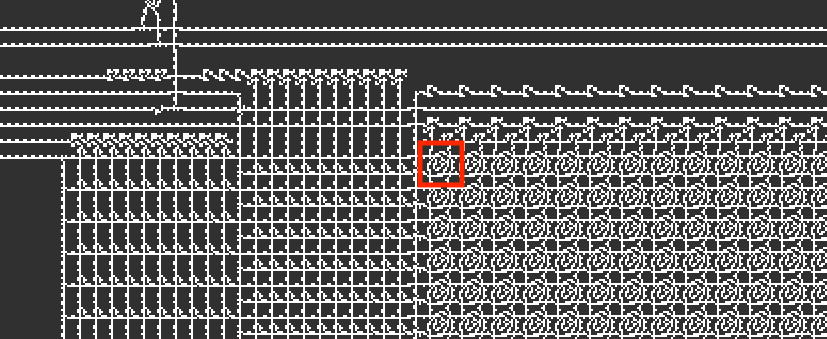
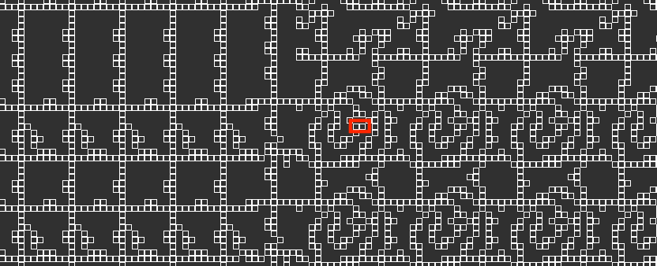
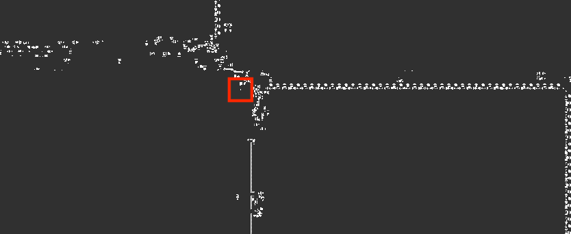

# Lisp in Conway's Game of Life

It's not Conway's Game of Life implemented in Lisp - it's a Lisp interpreter implemented in Conway's Game of Life.

The entire pattern is viewable on the browser [here](https://woodrush.github.io/lisp-in-life).


## Running Lisp and C on the Game of Life
This repository contains a Conway's Game of Life pattern that runs a Lisp interpreter.
The Lisp program is provided by editing certain cells within the pattern to represent the ASCII-encoding of the Lisp program.
The interpreter writes its standard output to the bottom end of the RAM module, which can be directly examined in a Game of Life viewer.
The Lisp implementation supports lexical closures and macros, allowing one to write Lisp programs in a Lisp-like taste, as far as the memory limit allows you to.

The [Lisp interpreter](./src/lisp.c) is written in C. Using the build system for this project, you can also compile your own C11-compatible C code and run in on Conway's Game of Life.


## Screenshots


An overview of the entire architecture.


An overview of the CPU and its surrounding modules. On the top are the ROM modules, with the lookup module on the right, and the value modules on the left. On the bottom left is the CPU. On the bottom right is the RAM module.

This pattern is the VarLife version of the architecture. VarLife is an 8-state cellular automaton defined in the [Quest For Tetris](https://codegolf.stackexchange.com/questions/11880/build-a-working-game-of-tetris-in-conways-game-of-life/142673#142673) (QFT) Project, which is used as an intermediate layer to create the final Conway's Game of Life pattern. The colors of the cells indicate the 8 distinct states of the VarLife rule.

The architecture is based on [Tetris8.mc](https://github.com/QuestForTetris/QFT/blob/master/Tetris8.mc) in the [original QFT repository](https://github.com/QuestForTetris/QFT). Various modifications were made from the original architecture, such as removing and adding new opcodes, creating a new lookup table architecture for the ROM module, reducing the bit length of the instruction size, extending the RAM address space, etc.


The Conway's Game of Life version of the architecture, converted from the VarLife pattern.
What appears to be a single cell in this image is actually an [OTCA metapixel](https://www.conwaylife.com/wiki/OTCA_metapixel) zoomed away to be shown 2048 times smaller.


A close-up view of a part of the ROM module in the Conway's Game of Life version.
Each pixel in the previous image is actually this square-shaped structure shown in this image.
These structures are [OTCA metapixels](https://www.conwaylife.com/wiki/OTCA_metapixel), which can be seen to be in the On and Off meta-states in this image.
The OTCA metapixel is a special Conway's Game of Life pattern that can emulate cellular automatons with customized rules.
The original VarLife pattern is simulated this way so that it can run in Conway's Game of Life.


The ALU unit in the CPU. From the left are the modules for the `ANT`, `XOR`, `SRE`, `SRU`, `SUB`, `ADD`, `MLZ`, and the `MNZ` opcodes.

The `SRE` and the `SRU` opcodes were newly added for this project.


A video of the RAM module of the QFT computer in the VarLife rule in action.


The computer showing the results of the following Lisp program:

```lisp
(print (* 3 14))
```

The result is `42`, shown in binary ascii format (0b110100, 0b110010), read in bottom-to-up order.


## How is it Done?
The [Lisp interpreter](./src/lisp.c), written in C, is compiled to an assembly language for a CPU architecture implemented in the Game of Life, which is a modification of the computer used in the [Quest For Tetris](https://codegolf.stackexchange.com/questions/11880/build-a-working-game-of-tetris-in-conways-game-of-life/142673#142673) (QFT) project.
The compilation is done using an extended version of [ELVM](https://github.com/shinh/elvm) (the Esoteric Language Virtual Machine). The Game of Life backend for ELVM was implemented by myself. The backend and the compiler is further modified for supporting QFT-specific optimizations (available in the submodule).

Generating a short enough Lisp interpreter assembly code and a Game of Life pattern that runs in a reasonable amount of time required a lot of effort.
This required optimizations and improvements in every layer of the project, including the C compiler layer, the CPU architecture layer, Game of Life layer, the C program layer, etc.
Examples of these optimizations include:

- The C Compiler layer - adding the [computed goto](https://en.wikipedia.org/wiki/Goto#Computed_GOTO_and_Assigned_GOTO) feature to the C compiler, preserving variable symbols to be used after compilation, etc.
- The C layer (the [Lisp interpreter](./src/lisp.c)) - using a string hashtable and binary search for Lisp symbol lookup, minimization of stack region usage with union memory structures, careful memory region map design, etc.
- The QFTASM layer - writing a [compiler optimizer](./src/qftasmopt.py) to optimize the length of the assembly code
- The VarLife layer - creating a lookup table architecture for faster ROM access, expanding the size and length of the RAM module, adding new opcodes, etc.
- The Game of Life layer - [Hashlife](https://en.wikipedia.org/wiki/Hashlife)-specific optimization

A more detailed description of the optimizations done in this project is available in the [Implementation Details](#implementation-details) section.
Details for building the interpreter's C source code is available in the [Building from Source](#building-from-source) section.


### Conversion from VarLife to Conway's Game of Life
VarLife is an 8-state cellular automaton defined in the [Quest For Tetris](https://codegolf.stackexchange.com/questions/11880/build-a-working-game-of-tetris-in-conways-game-of-life/142673#142673) (QFT) Project.
It is used as an intermediate layer to generate the final Conway's Game of Life pattern;
the computer is first created in VarLife, and then converted to a Game of Life pattern.

When converting VarLife to Conway's Game of Life, each VarLife cell is mapped to an [OTCA Metapixel](https://www.conwaylife.com/wiki/OTCA_metapixel) (OTCAMP).
The OTCA Metapixel is a special pattern that is capable of emulating a different game-of-life-like rule within the Game of Life.
Each cell carries a binary meta-state and a pre-programmed rule.

The conversion from VarLife to the Game of Life is done in a way so that the behavior of the states of the VarLife pattern matches exactly with the meta-states of the OTCA Metapixels in the converted Game of Life pattern.
Therefore, it is enough to verify the behavior of the VarLife pattern to verify the behavior of the Game of Life pattern.

Since one OTCA Metapixel has a bounding box size of 2048x2048 (when tiled together), converting the VarLife pattern to a Conway's Game of Life pattern will expand the pattern size by a factor of 2048x2048.
Also, since the OTCA Metapixel has a phase of 35,328 (according to [LifeWiki - OTCA metapixel](https://www.conwaylife.com/wiki/OTCA_metapixel)), the number of Conway's Game of Life generations required becomes 35,328 times the number of required VarLife generations.
Therefore, the VarLife patterns run significantly faster than the Game of Life (GoL) version.

### How is the Program and the Standard Input Provided? How is the Output Read Out? 
The Lisp interpreter accepts the Lisp code from the standard input and writes the results to the standard output.
Both the standard input and output reside within the RAM module, with memory addresses 290 and 790, respectively.

Since each byte of the RAM module can be ordered arbitrarily in the CPU's architecture, the RAM is arranged so that the standard output is written at the very bottom of the RAM module, and proceeds upwards. Therefore, the contents of the RAM can easily be observed in a Game of Life viewer by directly examining the bottom of the RAM module. A script for examining the output, as well as the input and other register values are available in the [QFT-devkit](https://github.com/woodrush/QFT-devkit) (also included as a submodule in this repository).

Since RAM has 16 bits of memory per memory address, it allows to fit two ASCII-encoded characters per one address. Therefore, the standard input is read out by reading two characters per address. For the standard output, one character is written to one address for aesthetic reasons, so that the characters can be directly observed in a Game of Life viewer the pattern more easily. Also, for the standard output to proceed upwards within the RAM module pattern, the memory pointer for the standard output proceeds backwards in the memory space, while the pointer for the standard input proceeds forwards in the memory space.


## Pattern Files
| Program                                                | VarLife Pattern                                                       | Conway's Game of Life Pattern                                                                    |
|--------------------------------------------------------|-----------------------------------------------------------------------|--------------------------------------------------------------------------------------------------|
| [object-oriented-like.lisp](object-oriented-like.lisp) | [QFT_object-oriented-like.mc](./patterns/QFT_object-oriented-like.mc) | [QFT_object-oriented-like_metafied.mc](./patterns/metafied/QFT_object-oriented-like_metafied.mc) |
| [z-combinator.lisp](z-combinator.lisp)                 | [QFT_z-combinator.mc](./patterns/QFT_z-combinator.mc)                 | [QFT_z-combinator_metafied.mc](./patterns/metafied/QFT_z-combinator_metafied.mc)                 |
| [backquote-splice.lisp](backquote-splice.lisp)         | [QFT_backquote-splice.mc](./patterns/QFT_backquote-splice.mc)         | [QFT_backquote-splice_metafied.mc](./patterns/metafied/QFT_backquote-splice_metafied.mc)         |
| [backquote.lisp](backquote.lisp)                       | [QFT_backquote.mc](./patterns/QFT_backquote.mc)                       | [QFT_backquote_metafied.mc](./patterns/metafied/QFT_backquote_metafied.mc)                       |
| [primes-print.lisp](primes-print.lisp)                 | [QFT_primes-print.mc](./patterns/QFT_primes-print.mc)                 | [QFT_primes-print_metafied.mc](./patterns/metafied/QFT_primes-print_metafied.mc)                 |
| [primes.lisp](primes.lisp)                             | [QFT_primes.mc](./patterns/QFT_primes.mc)                             | [QFT_primes_metafied.mc](./patterns/metafied/QFT_primes_metafied.mc)                             |
| [print.lisp](print.lisp)                               | [QFT_print.mc](./patterns/QFT_print.mc)                               | [QFT_print_metafied.mc](./patterns/metafied/QFT_print_metafied.mc)                               |

Pattern files preloaded with various Lisp programs are available here.
Details of the Lisp programs are explained later.
Detailed statistics such as the running time and the memory consumption are available in the "Running Times and Statistics" section.

The patterns can be simulted on the Game of Life simulator [Golly](https://en.wikipedia.org/wiki/Golly_(program)).
The VarLife patterns can be simulated on Golly as well, which requires additional settings described in the [Building from Source](#building-from-source) section.


### Descriptions of the Lisp Programs

- **object-oriented-like.lisp**:
    This example creates a structure similar to classes in Object-Oriented Programming, using closures.

    - The class has methods and field variables, where each instance carries distinct and persistent memory locations of their own.
    The example instantiates two counters and concurrently modifies the value held by each instance.
    - New syntaxes for instantiation and method access (`(new classname)` and `(. instance methodname)`) are introduced using macros and functions.

    The Lisp interpreter's variable scope and the macro feature is powerful enough to manage complex memory management,
    and even providing a new syntax to support the target paradigm.

- **z-combinator.lisp**:
Demonstration of the [Z Combinator](https://en.wikipedia.org/wiki/Fixed-point_combinator#Strict_fixed-point_combinator) to implement a factorial function
using [anonymous recursion](https://en.wikipedia.org/wiki/Anonymous_recursion).

- **backquote-splice.lisp**:
Implements the [backquote macro](http://cl-cookbook.sourceforge.net/macros.html#LtohTOCentry-2) used commonly in Lisp to construct macros.
It also supports the unquote and unquote-splice operations, each written as `~` and `~@`.

- **primes.lisp**: Prints a list of prime numbers up to 20. This example highlights the use of the `while` syntax.


The contents of print.lisp is quite straightforward.
backquote.lisp and primes-print.lisp are similar to backquote-splice.lisp and primes.lisp, mainly included for performance comparisons.
backquote.lisp doesn't implement the unquote-splice operation, and demonstrates some more examples.
primes-print.lisp reduces the number of list operations to save memory usage.


## Running Times and Statistics
**Common Statistics**
| Lisp Program                                           | #QFT CPU Cycles | QFT Memory Usage (QFT bytes) |
|------------------------------------------------------- |-----------------|------------------------------|
| [print.lisp](print.lisp)                               |           4,425 |                           92 |
| [z-combinator.lisp](z-combinator.lisp)                 |          58,883 |                          544 |
| [backquote-splice.lisp](backquote-splice.lisp)         |         142,353 |                          869 |
| [backquote.lisp](backquote.lisp)                       |         142,742 |                          876 |
| [object-oriented-like.lisp](object-oriented-like.lisp) |         161,843 |                          838 |
| [primes-print.lisp](primes-print.lisp)                 |         281,883 |                          527 |
| [primes.lisp](primes.lisp)                             |         304,964 |                          943 |

**VarLife Patterns**
| Lisp Program and Pattern (VarLife)                                                                         | #Halting Generations (VarLife) | Running Time (VarLife) | Memory Usage (VarLife)   |
|------------------------------------------------------------------------------------------------------------|--------------------------------|------------------------|--------------------------|
| [print.lisp](print.lisp)                               [[pattern](./patterns/QFT_print.mc)]                |            105,413,068 (exact) |             1.159 mins |                  5.0 GiB |
| [z-combinator.lisp](z-combinator.lisp)                 [[pattern](./patterns/QFT_z-combinator.mc)]         |          1,700,000,000         |             9.823 mins |                 23.4 GiB |
| [backquote-splice.lisp](backquote-splice.lisp)         [[pattern](./patterns/QFT_backquote-splice.mc)]     |          4,100,000,000         |            20.467 mins | 27.5 GiB (max. capacity) |
| [backquote.lisp](backquote.lisp)                       [[pattern](./patterns/QFT_backquote.mc)]            |          4,100,000,000         |            21.663 mins | 27.5 GiB (max. capacity) |
| [object-oriented-like.lisp](object-oriented-like.lisp) [[pattern](./patterns/QFT_object-oriented-like.mc)] |          4,673,000,000         |            22.363 mins | 27.5 GiB (max. capacity) |
| [primes-print.lisp](primes-print.lisp)                 [[pattern](./patterns/QFT_primes-print.mc)]         |          8,880,000,000         |            27.543 mins | 27.5 GiB (max. capacity) |
| [primes.lisp](primes.lisp)                             [[pattern](./patterns/QFT_primes.mc)]               |          9,607,100,000         |            38.334 mins | 27.5 GiB (max. capacity) |

**Conway's Game of Life (GoL) Patterns**
| Lisp Program and Pattern (GoL)                                                                                               | #Halting Generations (GoL) | Running Time (GoL) | Memory Usage (GoL)       |
|------------------------------------------------------------------------------------------------------------------------------|----------------------------|--------------------|--------------------------|
| [print.lisp](print.lisp)                               [[pattern](./patterns/metafied/QFT_print_metafied.mc)]                |         3,724,032,866,304  |      382.415 mins  | 27.5 GiB (max. capacity) |
| [z-combinator.lisp](z-combinator.lisp)                 [[pattern](./patterns/metafied/QFT_z-combinator_metafied.mc)]         |        60,057,600,000,000  |                 -  |                        - |
| [backquote-splice.lisp](backquote-splice.lisp)         [[pattern](./patterns/metafied/QFT_backquote-splice_metafied.mc)]     |       144,844,800,000,000  |                 -  |                        - |
| [backquote.lisp](backquote.lisp)                       [[pattern](./patterns/metafied/QFT_backquote_metafied.mc)]            |       144,844,800,000,000  |                 -  |                        - |
| [object-oriented-like.lisp](object-oriented-like.lisp) [[pattern](./patterns/metafied/QFT_object-oriented-like_metafied.mc)] |       165,087,744,000,000  |                 -  |                        - |
| [primes-print.lisp](primes-print.lisp)                 [[pattern](./patterns/metafied/QFT_primes-print_metafied.mc)]         |       313,712,640,000,000  |                 -  |                        - |
| [primes.lisp](primes.lisp)                             [[pattern](./patterns/metafied/QFT_primes_metafied.mc)]               |       339,399,628,800,000  |                 -  |                        - |

The running times for each program are shown above. The [Hashlife](https://en.wikipedia.org/wiki/Hashlife) algorithm used for the simulation requires a lot of memory in exchange of speedups.
The simulations were run on a 32GB-RAM computer, with Golly's memory usage limit set to 28000 MB, and the default base step to 2 (configurable from the preferences).
The memory usage was measured by Ubuntu's activity monitor.
The number of CPU cycles and the QFT memory usage was obtained by running the QFTASM interpreter on the host PC.
The QFT memory usage shows the number of RAM addresses that were written at least once.
The memory usage is measured in QFT bytes. Since one RAM memory slot includes 16 bits, 1 QFT byte equals 16bits.

After the program counter is set to 65535 and the program exits, no more ROM and RAM I/O signals become apparent in the entire module.
This makes the VarLife pattern becomes completely stationary, where every pattern henceforth becomes completely identical.
Defining this as the halting time for the calculation, the pattern for [print.lisp](print.lisp) halts at exactly 105,413,068 VarLife generations.


## Details of the Lisp Interpreter
### Special Forms and Builtin Functions

- define
- if
- quote
- car, cdr
- cons
- list
- atom
- print
- progn
- while
- lambda, macro
- eval
- eq
- +, -, *, /, mod, <, >

### Lexical Closures
This Lisp implementation supports lexical closures.
The implementation of lexical closures is powerful enough to write an object-oriented-like code as shown in [object-oriented-like.lisp](./object-oriented-like.lisp),
where classes are represented as lexical closures over the field variables and the class methods.

### Macros
This Lisp implementation has a macro feature. Lisp macros can be thought as a function that receives code and returns code.
Following this design, macros are treated exacly the same as lambdas, except that it takes the arguments as raw S-expressions,
and evaluates the result twice (the first time to build the expression, and the second time to actually evaluate the builded expression).


## Building from Source
### Tests
There are tests to check the behavior of the Lisp interpreter.
There is a test for checking the QFTASM-compiled Lisp interpreter using the QFTASM interpreter, and a test for checking the GCC-compiled Lisp interpreter on the host pc.
To run these tests, use the following commands:

```sh
make test             # Run the tests for the QFTASM-compiled Lisp interpreter, using the QFTASM interpreter
make test_executable  # Run the tests for the executable compiled by GCC
```

Running `make test` requires [Hy](https://github.com/hylang/hy), a Clojure-like Lisp implemented in Python available via `pip install hy`.
Some of the tests compare the output results of Hy and the output of the QFTASM Lisp interpreter.

The tests were run on Ubuntu and Mac.


### Build Instruction Details
This section explains how to load the Lisp interpreter (written in C) to the Game of Life pattern, and also how to load a custom Lisp program into the pattern to run it on Game of Life.

<details>
<summary>Click to expand</summary>

### Requirements
- Golly (version 4.0)
- Python 3.*
  - pyparsing>=2.3.1
  - numpy
  - hy>=0.14.0 (used for testing)
  - matplotlib (optional, required for creating memory access plots)
- git, gcc, make


### Building the Game of Life Pattern
Building the Game of Life pattern consists of four steps:

1. Building the assembly (QFTASM) file for the Lisp interpreter
2. Building the Varlife pattern for the Lisp interpreter
3. Loading the Lisp program into the Varlife pattern's RAM module
4. Metafying the Varlife pattern to a Conway's Game of Life pattern

The results after Step 2 is included in this repo as [./QFT-devkit/QFT_hashedrom_v11_interpreter.mc](./QFT-devkit/QFT_hashedrom_v11_interpreter.mc). If you are trying to load a custom Lisp program into the pattern, you can use this file and start from Step 3.

### Summary of the Build Flow
The summary of the build flow is as follows:


#### 1. Building the assembly (QFTASM) file for the Lisp interpreter
First, initialize the git submodules and then run `make all`.

```sh
git submodule update --init --recursive
make all
```

This will create the following files:
- `./out/lisp.qftasm` : The assembly file for the Lisp interpreter
- `./out/ramdump.csv` : The initial values of the RAM to be loaded before running. Contains the results of various precalculations such as the string hashtable construction.

These files should be identical to `./qftasm/lisp.qftasm` and `./qftasm/ramdump.csv`.

#### 2. Building the Varlife pattern for the Lisp interpreter
The following steps are done on Golly.

1. Open Golly and see File -> Preferences -> Control. Check the "Your Rules" directory.
Open the directory, and copy [./QFT-devkit/Varlife.rule](./QFT-devkit/Varlife.rule) to the directory.
2. Open File -> Set File Folder, and set the file folder to the root of this repository.
3. Select `./QFT-devkit/QFT_hashedrom_v11.mc` from the file explorer on the left. A QFT architecture without the ROM and the RAM should appear on the screen.
4. Select `./QFT-devkit/QFT_prep_rom_ram_hashedrom.py` from the file explorer. Several prompts will appear:
   - For the prompt to select the QFTASM file to load to the ROM, select `./out/lisp.qftasm`.
   - For the next prompt, "the maximum RAM address," use the following setting used in line 9 in `./elvm/target/elc.c`, the C -> QFTASM compiler:
     ```c
     int QFTASM_RAMSTDOUT_BUF_STARTPOSITION = 790;
     ```
     This is where the standard output is written in the RAM. This address will be placed at the very bottom of the RAM module pattern (each byte in the RAM can be ordered arbitrarily in this architecture).
     The same value appears in `./tools/runlisp.sh`, `./tools/build_optlisp.sh`, and `./src/qft.h`. When editing this value in `./elvm/target/elc.c`, edit these shellscripts as well.
   - For the next prompt for the "negative RAM buffer size," use 233. This is 1023-790.
   - After a while, the ROM and the RAM patterns will be created.
5. Save the resulting pattern under `./QFT-devkit`. This file should match with `./QFT-devkit/QFT_hashedrom_v11_interpreter.mc`.


#### 3. Loading the Lisp program into the Varlife pattern's RAM module
The following steps are done on Golly.
If you've skipped Steps 1 and 2, follow the first and second instructions in Step 2 to register the Varlife rule to Golly and to change the working directory before proceeding on to the following steps.

1. From the file explorer on the left, select `QFT_ram_reader_writer.py`.
   - For the "stack size", use the value as the same as the "negative RAM buffer size," in Step 2. This should be 233.
   - For the "stdin buffer starting address," use the following setting used in line 8 in `./elvm/target/elc.c`, the C -> QFTASM compiler:
     ```c
     int QFTASM_RAMSTDIN_BUF_STARTPOSITION = 290;
     ```
     This is where the standard input, i.e. the Lisp program (expressed as an ASCII string) is written into the RAM.
     The same value appears in `./tools/runlisp.sh`, `./tools/build_optlisp.sh`, and `./src/qft.h`. When editing this value in `./elvm/target/elc.c`, edit these shellscripts as well.
   - For the "stdout buffer starting address," use the same value as "the maximum RAM address" in Step 2. THis should be 790.
   - Next, a prompt to load the CSV for the initial RAM values will appear. From the repository's root directory, select `./build/ramdump.csv`. When a message that says the values were successfullly written to the RAM, press OK.
   - Next, a prompt to load the text file to write to the stdin buffer will appear. Select the Lisp program to load to the RAM. When a message that says the values were successfullly written to the RAM, press OK.
   - The following three messages will show the current values written inside the RAM. Press OK.
2. At this point, the Lisp program is loaded into the RAM module. Save the pattern file for use in the following steps.

The pattern obtained at this point is the Varlife pattern for the Lisp program and the interpreter. You can run this pattern directly on Golly and see the results. Details on running and viewing the output results is explained in the "Running the Varlife Pattern" section in the "Running the Lisp Program and Viewing the Standard Output" section.

Since each Varlife cell is extended to a 2048x2048 Conway's Game of Life pattern in the metafication process in the next step, the Varlife pattern created in this step runs significantly faster than the metafied Conway's Game of Life pattern created in the next step. The emulated patterns in each time step, including the final output, should be the same for the Varlife pattern and the metafied pattern.


#### 4. Creating the Game of Life Pattern
This step is for metafying the Varlife pattern obtained in Step 3 to create it to an equivalent Conway's Game of Life pattern.

1. Open the Varlife pattern created in Step 3. Press Ctrl+A (or Command+A, etc.) to select all of the cells in the pattern.
2. From the file explorer, click on `MetafierV3.py`. This will metafy the Varlife pattern to a Game of Life pattern. This process takes a while (about 1 minute) to complete. After the script finishes running, a new tab containing the Game of Life pattern will appear on Golly. Save this pattern for use in the following steps. This file should match with `./QFT-devkit/QFT_hashedrom_v11_interpreter_metafied.mc`.

The resulting pattern is a Conway's Game of Life pattern with the Lisp interpreter loaded with the specified Lisp program. This pattern can be run on any Game of Life engine of your choice. Details on running and viewing the output results is explained in the "Running the Game of Life Pattern" section in the "Running the Lisp Program and Viewing the Standard Output" section.


### Running the Lisp Program and Viewing the Standard Output
#### Running the Varlife Pattern
First, load the Varlife pattern created in Step 3. To start the calculation, click on the "Start generating" button on the top left, shown as the "play" icon. To speed up the calculation, make sure the "Hyperspeed" button with the thunderbolt icon (4 buttons below the "Start generating" button) is toggled on; this will let Golly use the [Hashlife](https://en.wikipedia.org/wiki/Hashlife) algorithm.

During the calculation, keep track of the number of generations shown on the top region. For [./print.lisp](./print.lisp), the calculation should be finished after about 730,000,000 generations. When the program finishes running, the increasing speed of the number of generations should become significantly faster; this indicates that the program has finished running. You can also keep track of the cells for the RAM's program counter byte, located at the very top byte of the RAM module. Each bit of the RAM cell is stored inside the two adjacent cells in the middle of the cell, which are either red or orange. The red and orange states each indicate the bits 0 and 1, respectively. When the program counter is at 65535, or 0b1111111111111111, it indicates that the program has finished running. When the program has finished running, press the "Stop generating" button on the top left (shown in place of the "Start generating" button).

To view a summary of the contents of the RAM, choose `QFT_ram_reader.py` from the file explorer. The first message visualizes the binary states of the register values and some regions from the stack region. The second message shows the register values in decimal. The final message shows the standard input and output regions interpreted as ASCII strings (terminated with 0x00).


#### Running the Game of Life Pattern
If you have just finished Step 4, reopen the saved pattern file again to adjust the cell coordinates.

Methods for running and viewing the results is basically the same for Varlife, explained in the previous section. Here are the main differences:
- Number of generations: In the Game of Life pattern, since each Varlife cell is converted to an [OTCA Metapixel](https://www.conwaylife.com/wiki/OTCA_metapixel), which has a phase of 35328, the number of generations required to emulate N generations in Varlife becomes 35328*N generations in Game of Life.
- Memory usage: The calculation will also require significantly more amount of RAM on the host computer. The memory size used for Golly can be set at File -> Preferences -> Control -> Maximum memory.
- RAM module state interpretation: The RAM bits are stored in the meta-cells with the same meta-locations of the Varlife pattern. The populated and unpopulated meta-states correspond to the bits 0 and 1, respectively.
- Viewing the RAM content summary: `QFT_ram_reader_metafied.py` is used to view the RAM content summary. The metafied version requires additional parameters due to the metafication process. The details are described in the following paragraph.

When using `QFT_ram_reader_metafied.py`, you will be prompted to input the coordinates of a certain cell within the pattern. This cell is located in the most top-left RAM cell, in the RAM's bit storage meta-cells, in the top-left corner of the OTCA metapixel where there is a [beehive](https://www.conwaylife.com/wiki/Beehive) pattern (shown below). The values should be `-65648599, -13895568`.

Below is a map to find the specific cell required for the input prompt. Use Golly to find the coordinates of this cell, and input it in the prompt.



The most top-left RAM cell.



The RAM bit storage meta-cells. Use the coordinates for the left meta-cell.



The top-left corner of the OTCA metapixel for the bit storage meta-cell. There is a [beehive](https://www.conwaylife.com/wiki/Beehive) pattern (also shown below) in the specified region.


The beehive pattern. Use the coordinates for the top pixel, marked in this figure.


### Game-of-Life-Closed Method for Loading and Running Lisp Programs (WIP)
`QFT_ram_reader_metafied.py` is a work-in-progress script for writing a Lisp program directly into the metafied pattern. This will allow to load and run Lisp programs into the Game of Life pattern closed within Game of Life cell manipulation operations, without using Varlife. The current script is able to write hard-coded values into the metafied RAM. It should be fairly straightforward to create a script to write the values of `ramdump.csv`, required for running the interpreter.


### Compiling the Lisp Interpreter with GCC
The Lisp interpreter [./src/lisp.c](./src/lisp.c) can be compiled with GCC and be run on a usual computer as well.

First, compile the Lisp interpreter and create `./out/lisp` by running:

```sh
make ./out/lisp 
```

To run some lisp programs and expressions by executing `./tools/runlisp_gcc.sh`, run:

```sh
make run_gcc
```


### Running the Lisp Programs on a QFTASM Interpreter (Emulator)
The Lisp programs can be tested by using a QFTASM interpreter (emulator) on the host computer.

This can be done by running

```sh
make run_qft
```

You can also plot the number of times a byte was written into for each byte in the RAM module. This can be done by running

```sh
make run_qft_memdist
```

This requires installing the Python package matplotlib, by running

```sh
pip install matplotlib
```


### Compiling the Sample C Program
The sample C program can be compiled and run by the following commands:

```sh
make hello
make run_hello
```

This creates `./out/hello.qftasm`. This QFTASM does not require `ramdump.csv` to be preloaded into the RAM module for it to run correctly.
To load the QFTASM file to a VarLife pattern, follow Step 2 ("2. Building the Varlife pattern for the Lisp interpreter").
To provide standard input to the program, follow Step 3. Using `ramdump.csv` can be skipped if your program does not require any preloading to the RAM.


#### Patterns for the Sample C Program
The patterns for the sample C program ([hello.c](./misc/hello/hello.c)) are available here:
- VarLife pattern: [QFT_hello.mc](./patterns/QFT_hello.mc)
- Conway's Game of Life Pattern: [QFT_hello_metafied.mc](./patterns/metafied/QFT_hello_metafied.mc)

This program can be compiled and run by using `make hello` and `make run_hello`. Further details are available in the [Building from Source](#building-from-source) section.


#### Stats for the Sample C Program
**VarLife Patterns**
| C Program                       | Stdin                                           | ROM Size | #Population | #CPU Cycles | QFT Memory Usage | #Halting Generations (VarLife) | Running Time (VarLife) | Memory Usage (VarLife) |
|---------------------------------|-------------------------------------------------|----------|-------------|-------------|------------------|--------------------------------|------------------------|------------------------|
| [lisp.c](./src/lisp.c)          | [print.lisp](print.lisp)                        |     3223 |   4,928,762 |       4,425 |     92 QFT bytes |            105,413,068 (exact) |             1.159 mins |                5.0 GiB |
| [lisp.c](./src/lisp.c)          | [z-combinator.lisp](z-combinator.lisp)          |     3223 |   4,928,762 |      58,883 |    544 QFT bytes |          1,700,000,000         |             9.823 mins |               23.4 GiB |
| [hello.c](./misc/hello/hello.c) | [hello_stdin.txt](./misc/hello/hello_stdin.txt) |      361 |   2,933,214 |      29,214 |    223 QFT bytes |            260,000,000         |             1.107 mins |                4.4 GiB |

**Conway's Game of Life Patterns**
| C Program                       | Stdin                                           | ROM Size | #Population     | #CPU Cycles | QFT Memory Usage | #Halting Generations (GoL) | Running Time (GoL) | Memory Usage (GoL)       |
|---------------------------------|-------------------------------------------------|----------|-----------------|-------------|------------------|----------------------------|--------------------|--------------------------|
| [lisp.c](./src/lisp.c)          | [print.lisp](print.lisp)                        |     3223 | 117,849,149,453 |       4,425 |     92 QFT bytes |          3,724,032,866,304 |       382.415 mins | 27.5 GiB (max. capacity) |
| [hello.c](./misc/hello/hello.c) | [hello_stdin.txt](./misc/hello/hello_stdin.txt) |      361 |  70,095,748,243 |      29,214 |    223 QFT bytes |          9,185,280,000,000 |      1322.537 mins | 27.5 GiB (max. capacity) |

The stats comparison for the sample program and the Lisp interpreter are shown above.
The ROM size is the number of rows in the ROM module, which is equivalent to the number of lines in the QFTASM file.

Despite the size of the number of CPU cycles, since the ROM size is significantly smaller for hello.c than lisp.c,
the program runs significantly faster both in terms of the actual running time and the generations per CPU cycle.
The generations per CPU cycle is 8899.84 for hello.c.

</details>

## Implementation Details
This section describes the implementation details for the various optimizations for the QFT assembly and the resulting Game of Life pattern.

<details>
<summary>Click to expand</summary>

### The C Compiler layer
- Added the computed goto feature to ELVM
  - This was merged into the original ELVM project.
- Modified the compiler to preserve and output memory address symbols and program address symbols, for their usage in the compiler optimization tool in the QFTASM layer
  - This allows to use [memheader.eir](./src/memheader.eir), so that symbols used in the C source can be referenced in the ELVM assembly layer using the same variable symbols.

### The ELVM Assembly layer
- Wrote the QFTASM backend for ELVM
  - This was merged into the original ELVM project.
- Added further improvements to the QFTASM backend:
  - Let the ELVM assembly's memory address space matches QFT's native memory address space
    - Originally, the ELVM assembly had to convert its memory address every time when a memory access occurs.
  - Support new opcodes added in the improved QFT architecture

### The C layer (the implementation of the Lisp interpreter)
#### Usage of binary search and hashtables for string representations and comparisons
By profiling the GCC-compiled version of the Lisp interpreter, it was found that the string table lookup process was a large performance bottleneck. This was a large room for optimization.

The optimized string lookup process is as follows.
First, when the Lisp parser accepts a symbol token, it creates a 4-bit hash of the string with the checksum of the ASCII representation of the string. The hash points to a hashtable that holds the root of a binary search tree for string comparison. Each node in the tree holds the string of the symbol token, and two nodes that are before and after the token in alphabetical order. When a query symbol token arrives in the parsing phase, a node with a matching token is returned, or a new node for the token is added into this binary tree if the token does not exist yet. This allows for each distinct symbol in the S-expression to have a distinct memory address.

In the interpretation phase, since each distinct symbol has a distinct memory address, and every string required for the Lisp program has already been parsed, string comparison can be done by simply comparing the memory address of the tokens. Since the interpreter only uses string equality operations for string comparison, simply checking for integer equality suffices for string comparison, speeding up the interpretation phase. Since the hash key is 4 bits long, this allows for reducing 4 searches in the binary tree compared to using a single binary tree.

#### Usage of jump hash tables for the special form evaluation procedure searches
There are 17 distinct procedures for evaluating the special forms in the Lisp interpreter,
`define`, `if`, `quote`, `car`, `cdr`, `cons`, `atom`, `print`, `progn`, `while`, {`lambda`, `macro`}, `eval`, `eq`, {`+`, `-`}, {`<`, `>`}, `list`, and lambda/macro invocations (when if the token is not a special form). Using an `if` statement to find the corresponding procedure for a given token becomes a linear search for the token comparisons. To speed up this search process, a hash table is created for jumping to the corresponding procedures. Since the memory addresses for the special forms can be determined before parsing the Lisp program, all of the symbols for the special forms have a fixed memory address. Therefore, the hash key can be created by subtracting an offset to the symbol's memory address, to point to a hashtable that is created near the register locations. This hashtable is provided in [memheader.eir](./src/memheader.eir). When the hash key is larger than the regions of this hashtable, it means that the symbol is not a special form, so the evaluation jumps to the lambda/macro invocation procedure.

#### Usage of 2-bit headers to represent value types
The Lisp implementation has 3 distinct value types, `ATOM`, `INT`, and `LAMBDA`. Each value only consumes one QFT byte of memory; the `ATOM` value holds the pointer to the symbol's string hashtable, the `INT` value holds the signed integer value, and `LAMBDA` holds a pointer to the `Lambda` struct, as well as its subtype information, of either `LAMBDA`, `MACRO`, `TEMPLAMBDA` and `TEMPMACRO`. (The `TEMPLAMBDA` and `TEMPMACRO` subtypes are lambda and macro types that recycles its argument value memory space every time it is called, but is unused in the final lisp programs.) Since the RAM's address space is only 10 bits, there are 6 free bits that can be used for addresses holding pointers. Therefore, the value type and subtype information is held in these free bits. This makes the integer in the Lisp implementation to be a 14-bit signed integer, ranging from -8192 to 8191.

#### Minimization of Stack Region Usage
Since the C compiler used in this project does not have memory optimization features, this has to be done manually within the C source code. This led to the largest reason why the interpreter's source code seems to be obfuscated.

One of the largest bottlenecks for memory access was stack region usage. Every time a stack region memory access occurs, the assembly code performs memory address offset operations to access the stack region. This does not happen when accessing the heap memory, since there is only one heap region used in the entire program, so the pointers for global variables can be hard-coded by the assembler. Therefore, it is favorable optimization-wise to use the heap memory as much as possible.

One way to make use of this fact is to use as much global variables as possible. Since registers and common RAM memory share the same memory space, global variables can be accessed with a speed comparable to registers (However, since the physical location of the RAM memory slot within the pattern affects the I/O signal arrival time, and the registers have the most smallest RAM addresses, i.e. they are the closest to the CPU unit, the registers have the fastest memory access time).

Another method of saving memory was to use union memory structures to minimize the stack region usage. In the C compiler used in this project, every time a new variable is introduced in a function, the function's stack region usage (used per call) is increased to fit all of the variables. This happens even when two variables never appear at the same time. Therefore, using the fact that some variables never appear simultaneously, unions are used for every occurence of such variables, so that they can use a shared region within the stack space. This led to minimization of the stack region usage. Since the stack region is only 233 hextets (1 byte in the QFT RAM is 16 bits) large, this allowed to increase the number of nested function calls, especially the nested calls of `eval` which evaluates the S-expressions. Since the S-expressions have a list structure, and `eval` becomes nested when lambdas are called in the Lisp program, this optimization was significant for allowing more sophisticated Lisp programs to be run in the architecture.


### The QFTASM layer
The QFT assembly generated by the C compiler has a lot of room for optimization. I therefore created a compiler optimization tool to reduce the QFTASM assembly size.

#### Constant folding
Immediate constant expressions such as `ADD 1 2 destination` is folded to a `MOV` operation.

#### `MOV` folding
The QFT assembly code can be splitted into subregions by jump operations, such that:

- Each subregion doesn't contain any jump operations
- Each subregion ends with a jump operation
- Every jump operation in the assembly is guaranteed to jump to the beginning of a subregion, and never to the middle of any subregion

The last guarantee where jumps never occur in the middle of a subregion is provided by the C compiler. The ELVM assembly's program counter is designed so that it increases only when a jump instruction appears. This makes an ELVM program counter to point to a sequence of multiple instructions, instead of a single instruction. Since the ELVM assembly uses the ELVM program counter for its jump instructions, it is guaranteed that the jump instructions in the QFT assembly never jump to the middle of any subregion, and always jumps to a beginning of a subregion.

In each subregion, the dependency graph for the memory address is created. If a memory address becomes written but is later overwritten without becoming used in that subregion at all, the instruction to write to that memory address is removed. Since it is guaranteed that jump operations never jump to the middle of any subregion, it is guaranteed that the overwritten values can be safely removed without affecting the outcome of the program. The `MOV` folding optimization makes use of this fact to remove unnecessary instructions.

This folding process is also done with dereferences; if a dereferenced memory address is written, and the address is overwritten without being used at all, and the dereference source is unoverwritten at all during this process, the instruction for writingto the dereferenced memory address is removed.

#### Jump folding
If the destination of a conditional or fixed-destination jump instruction points to another jump instruction with a fixed destination, the jump destination is folded to the latter jump instruction's destination. 

A similar folding is done when a fixed jump instruction points to a conditional jump instruction, where the fixed jump instruction is replaced by the latter conditional jump instruction.


### The Varlife layer (the computer architecture)
#### Created the with a lookup table structure for the ROM module
In [this image](./img/ss2.png) of the CPU and its surrounding modules, the two modules on the top are the ROM modules. The original ROM module had one table, with the memory address as the key and the instruction as the value. I recreated the ROM module to add a lookup table layer, where each distinct instruction (not the opcodes, but the entire instruction including the values used within) holds a distinct serial integer key. The ROM module on the right accepts a program counter address and returns the instruction key for the program counter. The module on the left accepts the instruction key and returns the actual bits of the instruction as the output. This allows for dictionary compression to be performed to the ROM data, saving a lot of space. Since the instructions are 45 bits and the instruction keys are only 10 bits, the instruction key table is 1/4 the size of the original ROM module. Although the ROM size is 3223 for the entire Lisp interpreter, there were only 616 distinct instructions in the Lisp interpreter, making the size of the instruction table be 616 ROM units high, effectively reducing the ROM module size altogether.

The ROM module features another form of compression, where absence of cells are used to represent 0-valued bits within the instruction. Below is a close-up look of the ROM value module:


Notice that some cells on the left are absent, despite the table being expected to be a rectangular shape. This is because absent cells do not emit any signals, hence effectively emitting 0-valued bits as the output. To use this fact, all of the instructions are first alphabetically ordered at table creation time, so that instructions that start with trailing zeroes become located higher in the table (further from the signal source). This allows for a maximum number of cells to be replaced with absent units to represent 0-valued bits. In fact, the instruction for no-ops is represented as all zeroes, so all of the units in the value module are replaced by absent cells. The no-op instruction appears a lot of times immediately after the jump operation, due to the fact that the QFT architecture has a branch delay when invoking a jump instruction, requiring a no-op instruction to be present to compensate for the delay.

#### Added new optimized instructions to the ALU, and removed unused ones
I removed the `AND`, `OR`, `SL` (shift left), `SRL` (shift right logical), and the `SRA` (shift right arithmetical) opcodes, and added the `SRU` (shift right unit) and `SRE` (shift right eight) opcodes to the architecture. Since there already were opcodes for `XOR` (bitwise-xor) and `ANT` (bitwise-and-not), `AND` and `OR`, which were not used much in the interpreter, could be replaced by these opcodes. The bitshift operations had significantly larger patterns than the other opcodes, being more than 10 times larger than the other opcodes. These were reduced to a fixed-size shift operations which could be implemented in the same sizes as the other opcodes. Since the shift left opcode can be replaced by consecutively adding its own value, effectively multiplying by powers of 2, the opcode was safely removed. The main reason for the original bitshift units being large was due to the shift amounts being dependent on the values of the RAM. Converting a binary value to a physical (in-pattern) shift amount required a large pattern. On the other hand, shifting a fixed value could be implemented by a significantly more simpler pattern. The shift right eight instruction is mainly used for reading out the standard input, where each ASCII character in the input string is packed into one 16-bit RAM memory address.

This resulted in a total of exactly 8 opcodes, `ANT`, `XOR`, `SRE`, `SRU`, `SUB`, `ADD`, `MLZ`, and `MNZ`. Since this can fit in 3 bits, the opcode region for the instruction value was reduced by 1 bit. Since the RAM module is 10 bits, and the third value of the instruction is always the writing destination of the RAM, and the first instruction can also be made so that it becomes the reading source address of the RAM, this allows for an additional 6*2=12 bits to be reduced from the instruction length. These altogether has reduced the ROM word size from 58 to 45 bits, being nearly 1/4 of the original instruction size.

#### Extended the ROM and RAM address space from 9,7-bit to 12,10-bit
The original QFT architecture had a ROM and RAM address space of 9 and 7 bits. I extended the ROM and RAM address space to 12 and 10 bits, respectively. This was not a straightforward task as it first seemed, since the signal arrival timings between the modules had to be carefully adjusted in order for the signals to line up correctly. This involved reverse-engineering and experimenting undocumented VarLife pattern units used in the original QFT architecture. The same held for when redesigning other parts of the architecture.


### The Game of Life layer
Optimizing the Game of Life layer mainly revolved around understanding the [Macrocell](https://www.conwaylife.com/wiki/Macrocell) format for representing and saving Game of Life patterns, and the Hashlife](https://en.wikipedia.org/wiki/Hashlife) algorithm. The Macrocell format uses quadtrees and memoization for compressing repeated patterns. Since the final Game of Life pattern is an array of OTCA metapixels which are 2048x2048 large, and even has repeated patterns in the VarLife layer (meaning that there are repeated configurations of OTCA metapixels), this compression reduces the file size for the QFT pattern significantly. The best example that let me understand the Macrocell format was an example provided by Adam P. Goucher in [this thread](https://sourceforge.net/p/golly/mailman/golly-test/thread/983116CEB3464154AF26245F052EFB36%40adamspackard/) in Golly's mailing list.

The Hashlife algorithm also uses quadtrees and memoization to speed up the Game of Life simulations. This algorithm makes use of the fact that the same pattern in a same time frame influences only a fixed extent of its surrounding regions, hence allowing for memoization.

As for optimization, I first noticed that the QFT pattern had a 1-pixel high pattern concatenated to the entire pattern. The original QFT pattern in the original QFT repository was carefully designed so that it is composed of 8x8-sized pattern units. Therefore, most of the patterns can be represented by 8x8 tiles. However, since the 1-pixel high pattern at the top creates an offset that shifts away the pattern from this 8x8 grid, it causes the pattern to have fewer repeated patterns if interpreted from the corner of its bounding box, causing the memoization to work inefficiently. I therefore tried putting a redundant cell (which does not interfere with the rest of the pattern) to realign the entire pattern to its 8x8 grid, which actually slightly reduced the resulting Macrocell file size from the original one. Although I didn't compare the running times, since the Hashlife algorithm uses memoization over repeated patterns as well, I expect this optimization to at least slightly contribute to the performance of the simulation.

Another optimization was improving the metafier script used to convert VarLife patterns to Game of Life ([MetafierV3.py](https://github.com/woodrush/QFT-devkit/blob/main/MetafierV3.py)). The original script used a square region to fit the entire pattern to create the quadtree representation. However, since the Lisp in Life VarLife pattern is 968 pixels wide but 42354 pixels high, it tried to allocate a 65536x65536-sized integer array, which was prohibitively large to run. I modified the script so that it uses a rectangular region, where absent regions of the quadtree are represented as absent cells. Although this is very straightforward with the knowledge of the Macrocell format, it was difficult at first until I became fond of the algorithms surrounding the Game of Life.


### Miscellaneous
#### Halting Time
For the VarLife pattern of [print.lisp](print.lisp), by generation 105,387,540, the value 65535 gets written to the program counter. At generation 105,413,067, the last signal becomes just one step from disappearing, and at generation 105,413,068 and onwards, the pattern becomes completely stationary and every pattern becomes identical to each other.
In the Game of Life version, since the OTCA Metapixel continues running indefinitely, the pattern does not become completly stationary, but the meta-states of the OTCA Metapixels will become completely stationary, since it is an emulation of the VarLife pattern.
Note that the halting times for programs other than print.lisp is just a sufficient number of generations, and not the exact values.

The required number of generations per CPU cycle depends on many factors such as the ROM and RAM addresses and the types of opcodes, since the arriving times of the I/O signals depend on factors such as these as well. This makes the number of generations required for the program to halt become different between each program.
For example, print.lisp has a rate of 23822.16 generations per CPU cycle (GpC), but z-combinator.lisp has a rate of 28870.81 GpC, and primes-print.lisp has 31502.43 GpC. 23822.16 GpC is in fact insufficient for z-combinator.lisp to finish running, and 28870.81 is also insufficient for primes-print.lisp to finish running.

</details>
