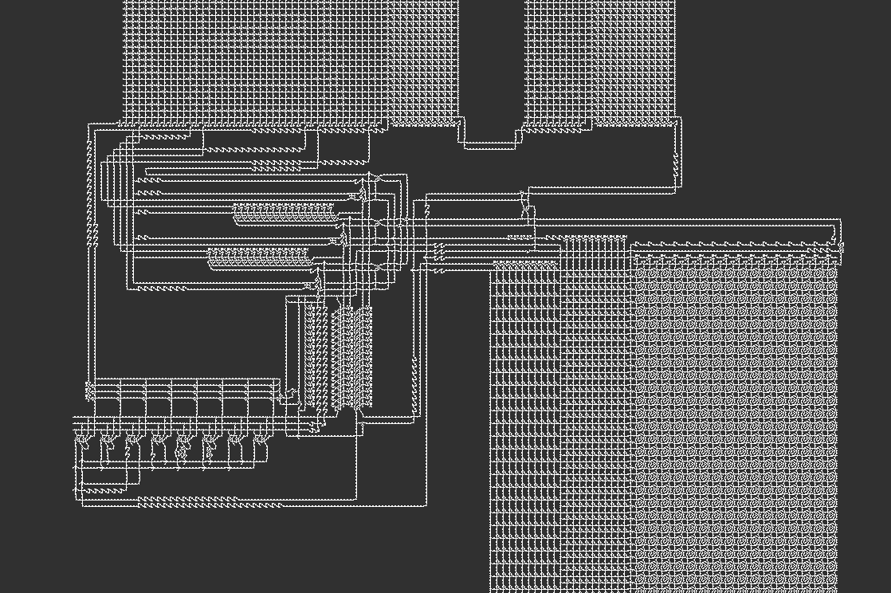
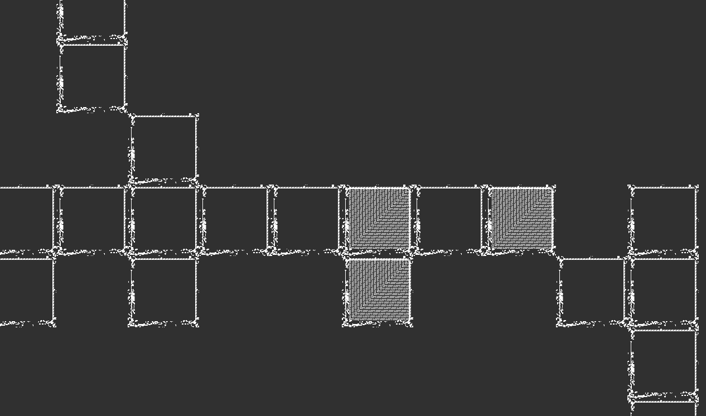
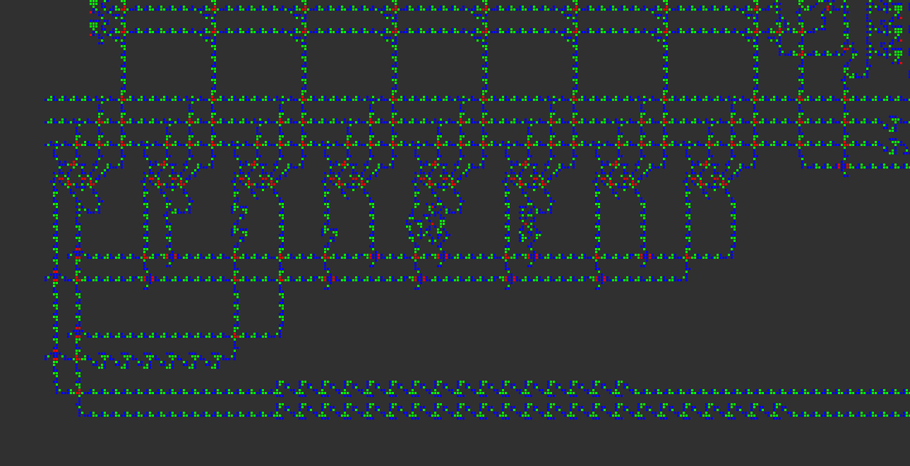
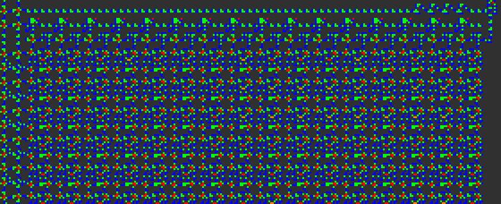

# Lisp in Conway's Game of Life

Lisp in Life is a Lisp interpreter implemented in Conway's Game of Life.

The entire pattern is viewable on the browser [here](https://woodrush.github.io/lisp-in-life).


## Running Lisp and C on the Game of Life
This repository contains a Conway's Game of Life pattern that runs a Lisp interpreter.
The Lisp program is provided by editing certain cells within the pattern to represent the ASCII-encoding of the Lisp program.
The interpreter writes its standard output to the bottom end of the RAM module, which can be directly examined in a Game of Life viewer.
The Lisp implementation supports lexical closures and macros, allowing one to write Lisp programs in a Lisp-like taste, as far as the memory limit allows you to.

The [Lisp interpreter](./src/lisp.c) is written in C. Using the build system for this project, you can also compile your own C11-compatible C code and run in on Conway's Game of Life.


## Screenshots


An overview of the entire architecture.


An overview of the CPU and its surrounding modules. On the top are the ROM modules, with the lookup module on the right, and the value modules on the left. On the bottom left is the CPU. On the bottom right is the RAM module.

This pattern is the VarLife version of the architecture. VarLife is an 8-state cellular automaton defined in the [Quest For Tetris](https://codegolf.stackexchange.com/questions/11880/build-a-working-game-of-tetris-in-conways-game-of-life/142673#142673) (QFT) Project, which is used as an intermediate layer to create the final Conway's Game of Life pattern. The colors of the cells indicate the 8 distinct states of the VarLife rule.

The architecture is based on [Tetris8.mc](https://github.com/QuestForTetris/QFT/blob/master/Tetris8.mc) in the [original QFT repository](https://github.com/QuestForTetris/QFT). Various modifications were made from the original architecture, such as removing and adding new opcodes, creating a new lookup table architecture for the ROM module, reducing the bit length of the instruction size, extending the RAM address space, etc.



The Conway's Game of Life version of the architecture, converted from the VarLife pattern.
What appears to be a single cell in this image is actually an [OTCA metapixel](https://www.conwaylife.com/wiki/OTCA_metapixel) zoomed away to be shown 2048 times smaller.



A close-up view of a part of the ROM module in the Conway's Game of Life version.
Each pixel in the previous image is actually this square-shaped structure shown in this image.
These structures are [OTCA metapixels](https://www.conwaylife.com/wiki/OTCA_metapixel), which can be seen to be in the On and Off meta-states in this image.
The OTCA metapixel is a special Conway's Game of Life pattern that can emulate cellular automatons with customized rules.
The original VarLife pattern is simulated this way so that it can run in Conway's Game of Life.



The ALU unit in the CPU. From the left are the modules for the `ANT`, `XOR`, `SRE`, `SRU`, `SUB`, `ADD`, `MLZ`, and the `MNZ` opcodes.

The `SRE` and the `SRU` opcodes were newly added for this project.



A video of the RAM module of the QFT computer in the VarLife rule in action.


The computer showing the results of the following Lisp program:

```lisp
(print (* 3 14))
```

The result is `42`, shown in binary ascii format (`0b110100`, `0b110010`), read in bottom-to-up order.

As shown in this image, the standard output of the Lisp program gets written at the bottom end of the RAM module, and can be directly viewed in a Game of Life viewer.
This repository also contains scripts that run on Golly to decode and view the contents of the output as strings.


## How is it Done?
The [Lisp interpreter](./src/lisp.c), written in C, is compiled to an assembly language for a CPU architecture implemented in the Game of Life, which is a modification of the computer used in the [Quest For Tetris](https://codegolf.stackexchange.com/questions/11880/build-a-working-game-of-tetris-in-conways-game-of-life/142673#142673) (QFT) project.
The compilation is done using an extended version of [ELVM](https://github.com/shinh/elvm) (the Esoteric Language Virtual Machine). The Game of Life backend for ELVM was implemented by myself.

Generating a short enough Lisp interpreter assembly code and a Game of Life pattern that runs in a reasonable amount of time required a lot of effort.
This required optimizations and improvements in every layer of the project, including the C compiler layer, the CPU architecture layer, including:

- The C Compiler layer - adding the [computed goto](https://en.wikipedia.org/wiki/Goto#Computed_GOTO_and_Assigned_GOTO) feature to the C compiler, preserving variable symbols to be used after compilation, etc.
- The C layer (the [Lisp interpreter](./src/lisp.c)) - using a string hashtable and binary search for Lisp symbol lookup, minimization of stack region usage with union memory structures, careful memory region map design, etc.
- The QFTASM layer - writing a [compiler optimizer](./src/qftasmopt.py) to optimize the length of the assembly code
- The VarLife layer - creating a lookup table architecture for faster ROM access, expanding the size and length of the RAM module, adding new opcodes, etc.
- The Game of Life layer - [Hashlife](https://en.wikipedia.org/wiki/Hashlife)-specific optimization

A more detailed description of the optimizations done in this project is available in the [Implementation Details](#implementation-details) section.


### Conversion from VarLife to Conway's Game of Life
VarLife is an 8-state cellular automaton defined in the [Quest For Tetris](https://codegolf.stackexchange.com/questions/11880/build-a-working-game-of-tetris-in-conways-game-of-life/142673#142673) (QFT) Project.
It is used as an intermediate layer to generate the final Conway's Game of Life pattern; the computer is first created in VarLife, and then converted to a Game of Life pattern.

When converting VarLife to Conway's Game of Life, each VarLife cell is mapped to an [OTCA Metapixel](https://www.conwaylife.com/wiki/OTCA_metapixel) (OTCAMP). The conversion from VarLife to the Game of Life is done in a way so that the behavior of the states of the VarLife pattern matches exactly with the meta-states of the OTCA Metapixels in the converted Game of Life pattern.
Therefore, it is enough to verify the behavior of the VarLife pattern to verify the behavior of the Game of Life pattern.

Due to the use of OTCA Metapixels, each VarLife cell becomes extended to a 2048x2048 Game of Life cell, and 1 VarLife generation requires 35328 Game of Life generations. Therefore, the VarLife patterns run significantly faster than the Game of Life (GoL) version.

Additional details on VarLife are available in the Miscellaneous section in [details.md](./details.md).


## Pattern Files
**1024-Word-RAM Architecture**
| Program                                                       | VarLife Pattern                                                       | Conway's Game of Life Pattern                                                                    |
|---------------------------------------------------------------|-----------------------------------------------------------------------|--------------------------------------------------------------------------------------------------|
| [print.lisp](./lisp/print.lisp)                               | [QFT_print.mc](./patterns/QFT_print.mc)                               | [QFT_print_metafied.mc](./patterns/metafied/QFT_print_metafied.mc)                               |
| [printquote.lisp](./lisp/printquote.lisp)                     | [QFT_printquote.mc](./patterns/QFT_printquote.mc)                     | [QFT_printquote_metafied.mc](./patterns/metafied/QFT_printquote_metafied.mc)                     |
| [factorial.lisp](./lisp/factorial.lisp)                       | [QFT_factorial.mc](./patterns/QFT_factorial.mc)                       | [QFT_factorial_metafied.mc](./patterns/metafied/QFT_factorial_metafied.mc)                       |
| [z-combinator.lisp](./lisp/z-combinator.lisp)                 | [QFT_z-combinator.mc](./patterns/QFT_z-combinator.mc)                 | [QFT_z-combinator_metafied.mc](./patterns/metafied/QFT_z-combinator_metafied.mc)                 |
| [backquote-splice.lisp](./lisp/backquote-splice.lisp)         | [QFT_backquote-splice.mc](./patterns/QFT_backquote-splice.mc)         | [QFT_backquote-splice_metafied.mc](./patterns/metafied/QFT_backquote-splice_metafied.mc)         |
| [backquote.lisp](./lisp/backquote.lisp)                       | [QFT_backquote.mc](./patterns/QFT_backquote.mc)                       | [QFT_backquote_metafied.mc](./patterns/metafied/QFT_backquote_metafied.mc)                       |
| [object-oriented-like.lisp](./lisp/object-oriented-like.lisp) | [QFT_object-oriented-like.mc](./patterns/QFT_object-oriented-like.mc) | [QFT_object-oriented-like_metafied.mc](./patterns/metafied/QFT_object-oriented-like_metafied.mc) |
| [primes-print.lisp](./lisp/primes-print.lisp)                 | [QFT_primes-print.mc](./patterns/QFT_primes-print.mc)                 | [QFT_primes-print_metafied.mc](./patterns/metafied/QFT_primes-print_metafied.mc)                 |
| [primes.lisp](./lisp/primes.lisp)                             | [QFT_primes.mc](./patterns/QFT_primes.mc)                             | [QFT_primes_metafied.mc](./patterns/metafied/QFT_primes_metafied.mc)                             |

**512-Word-RAM Architecture**
| Program                                                       | VarLife Pattern                                                       | Conway's Game of Life Pattern                                                                    |
|---------------------------------------------------------------|-----------------------------------------------------------------------|--------------------------------------------------------------------------------------------------|
| [print.lisp](./lisp/print.lisp)                               | [QFT_512_print.mc](./patterns/ram-512/QFT_512_print.mc)               | [QFT_512_print_metafied.mc](./patterns/ram-512/metafied/QFT_512_print_metafied.mc)               |
| [printquote.lisp](./lisp/printquote.lisp)                     | [QFT_512_printquote.mc](./patterns/ram-512/QFT_512_printquote.mc)     | [QFT_512_printquote_metafied.mc](./patterns/ram-512/metafied/QFT_512_printquote_metafied.mc)     |
| [factorial.lisp](./lisp/factorial.lisp)                       | [QFT_512_factorial.mc](./patterns/ram-512/QFT_512_factorial.mc)       | [QFT_512_factorial_metafied.mc](./patterns/ram-512/metafied/QFT_512_factorial_metafied.mc)       |

Pattern files preloaded with various Lisp programs are available here.
Detailed statistics such as the running time and the memory consumption are available in the [Running Times and Statistics](#running-times-and-statistics) section.

The patterns can be simulted on the Game of Life simulator [Golly](https://en.wikipedia.org/wiki/Golly_(program)).
The VarLife patterns can be simulated on Golly as well, which requires additional settings described in the [Building from Source](#building-from-source) section.


### Descriptions of the Lisp Programs

- **object-oriented-like.lisp**:
    This example creates a structure similar to classes in Object-Oriented Programming, using closures.

    - The class has methods and field variables, where each instance carries distinct and persistent memory locations of their own.
    The example instantiates two counters and concurrently modifies the value held by each instance.
    - New syntaxes for instantiation and method access, `(new classname)` and `(. instance methodname)`, are introduced using macros and functions.

    The Lisp interpreter's variable scope and the macro feature is powerful enough to manage complex memory management,
    and even providing a new syntax to support the target paradigm.

- **z-combinator.lisp**:
Demonstration of the [Z Combinator](https://en.wikipedia.org/wiki/Fixed-point_combinator#Strict_fixed-point_combinator) to implement a factorial function
using [anonymous recursion](https://en.wikipedia.org/wiki/Anonymous_recursion).

- **backquote-splice.lisp**:
Implements the [backquote macro](http://cl-cookbook.sourceforge.net/macros.html#LtohTOCentry-2) used commonly in Lisp to construct macros.
It also supports the unquote and unquote-splice operations, each written as `~` and `~@`.

- **primes.lisp**: Prints a list of prime numbers up to 20. This example highlights the use of the `while` syntax.


The contents of print.lisp is quite straightforward - it calculates and prints the result of `3 * 14`.
backquote.lisp and primes-print.lisp are similar to backquote-splice.lisp and primes.lisp, mainly included for performance comparisons.
backquote.lisp doesn't implement the unquote-splice operation, and demonstrates some more examples.
primes-print.lisp reduces the number of list operations to save memory usage.


## Running Times and Statistics
### 1024-QFT-byte RAM Architecture
**VarLife Patterns**
| Lisp Program and Pattern (VarLife)                                                                                | #Halting Generations (VarLife) | Running Time (VarLife) | Memory Usage (VarLife)   |
|-------------------------------------------------------------------------------------------------------------------|--------------------------------|------------------------|--------------------------|
| [print.lisp](./lisp/print.lisp)                               [[pattern](./patterns/QFT_print.mc)]                |            105,413,068 (exact) |             1.159 mins |                  5.0 GiB |
| [printquote.lisp](./lisp/printquote.lisp)                     [[pattern](./patterns/QFT_printquote.mc)]           |            800,000,000         |             3.424 mins |                 12.5 GiB |
| [factorial.lisp](./lisp/factorial.lisp)                       [[pattern](./patterns/QFT_factorial.mc)]            |          1,000,000,000         |             5.200 mins |                 17.9 GiB |
| [z-combinator.lisp](./lisp/z-combinator.lisp)                 [[pattern](./patterns/QFT_z-combinator.mc)]         |          1,700,000,000         |             9.823 mins |                 23.4 GiB |
| [backquote-splice.lisp](./lisp/backquote-splice.lisp)         [[pattern](./patterns/QFT_backquote-splice.mc)]     |          4,100,000,000         |            20.467 mins | 27.5 GiB (max. capacity) |
| [backquote.lisp](./lisp/backquote.lisp)                       [[pattern](./patterns/QFT_backquote.mc)]            |          4,100,000,000         |            21.663 mins | 27.5 GiB (max. capacity) |
| [object-oriented-like.lisp](./lisp/object-oriented-like.lisp) [[pattern](./patterns/QFT_object-oriented-like.mc)] |          4,673,000,000         |            22.363 mins | 27.5 GiB (max. capacity) |
| [primes-print.lisp](./lisp/primes-print.lisp)                 [[pattern](./patterns/QFT_primes-print.mc)]         |          8,880,000,000         |            27.543 mins | 27.5 GiB (max. capacity) |
| [primes.lisp](./lisp/primes.lisp)                             [[pattern](./patterns/QFT_primes.mc)]               |          9,607,100,000         |            38.334 mins | 27.5 GiB (max. capacity) |

**Conway's Game of Life (GoL) Patterns**
| Lisp Program and Pattern (GoL)                                                                                                      | #Halting Generations (GoL) | Running Time (GoL) | Memory Usage (GoL)       |
|-------------------------------------------------------------------------------------------------------------------------------------|----------------------------|--------------------|--------------------------|
| [print.lisp](./lisp/print.lisp)                               [[pattern](./patterns/metafied/QFT_print_metafied.mc)]                |         3,724,032,866,304  |      382.415 mins  | 27.5 GiB (max. capacity) |
| [printquote.lisp](./lisp/printquote.lisp)                     [[pattern](./patterns/metafied/QFT_printquote_metafied.mc)]           |        28,262,400,000,000  |                 -  |                        - |
| [factorial.lisp](./lisp/factorial.lisp)                       [[pattern](./patterns/metafied/QFT_factorial_metafied.mc)]            |        35,328,000,000,000  |                 -  |                        - |
| [z-combinator.lisp](./lisp/z-combinator.lisp)                 [[pattern](./patterns/metafied/QFT_z-combinator_metafied.mc)]         |        60,057,600,000,000  |                 -  |                        - |
| [backquote-splice.lisp](./lisp/backquote-splice.lisp)         [[pattern](./patterns/metafied/QFT_backquote-splice_metafied.mc)]     |       144,844,800,000,000  |                 -  |                        - |
| [backquote.lisp](./lisp/backquote.lisp)                       [[pattern](./patterns/metafied/QFT_backquote_metafied.mc)]            |       144,844,800,000,000  |                 -  |                        - |
| [object-oriented-like.lisp](./lisp/object-oriented-like.lisp) [[pattern](./patterns/metafied/QFT_object-oriented-like_metafied.mc)] |       165,087,744,000,000  |                 -  |                        - |
| [primes-print.lisp](./lisp/primes-print.lisp)                 [[pattern](./patterns/metafied/QFT_primes-print_metafied.mc)]         |       313,712,640,000,000  |                 -  |                        - |
| [primes.lisp](./lisp/primes.lisp)                             [[pattern](./patterns/metafied/QFT_primes_metafied.mc)]               |       339,399,628,800,000  |                 -  |                        - |

**Common Statistics**
| Lisp Program                                                  | #QFT CPU Cycles | QFT RAM Usage (Words) |
|-------------------------------------------------------------- |-----------------|-----------------------|
| [print.lisp](./lisp/print.lisp)                               |           4,425 |                    92 |
| [printquote.lisp](./lisp/printquote.lisp)                     |          18,730 |                   271 |
| [factorial.lisp](./lisp/factorial.lisp)                       |          28,623 |                   371 |
| [z-combinator.lisp](./lisp/z-combinator.lisp)                 |          58,883 |                   544 |
| [backquote-splice.lisp](./lisp/backquote-splice.lisp)         |         142,353 |                   869 |
| [backquote.lisp](./lisp/backquote.lisp)                       |         142,742 |                   876 |
| [object-oriented-like.lisp](./lisp/object-oriented-like.lisp) |         161,843 |                   838 |
| [primes-print.lisp](./lisp/primes-print.lisp)                 |         281,883 |                   527 |
| [primes.lisp](./lisp/primes.lisp)                             |         304,964 |                   943 |


### 512-QFT-byte RAM Architecture
**VarLife Patterns**
| Lisp Program and Pattern (VarLife)                                                              | #Halting Generations (VarLife) | Running Time (VarLife) | Memory Usage (VarLife)   |
|-------------------------------------------------------------------------------------------------|--------------------------------|------------------------|--------------------------|
| [print.lisp](./lisp/print.lisp)           [[pattern](./patterns/ram-512/QFT_512_print.mc)]      |            104,877,532 (exact) |             0.978 mins |                  4.0 GiB |
| [printquote.lisp](./lisp/printquote.lisp) [[pattern](./patterns/ram-512/QFT_512_printquote.mc)] |            800,000,000         |             2.906 mins |                 12.5 GiB |
| [factorial.lisp](./lisp/factorial.lisp)   [[pattern](./patterns/ram-512/QFT_512_factorial.mc)]  |          1,000,000,000         |             4.429 mins |                 13.7 GiB |

**Conway's Game of Life (GoL) Patterns**
| Lisp Program and Pattern (GoL)                                                                               | #Halting Generations (GoL) | Running Time (GoL) | Memory Usage (GoL)       |
|--------------------------------------------------------------------------------------------------------------|----------------------------|--------------------|--------------------------|
| [print.lisp](./lisp/print.lisp)           [[pattern](./patterns/ram-512/metafied/QFT_512_print_metafied.mc)] |         3,705,113,450,496  |                  - |                        - |
| [printquote.lisp](./lisp/printquote.lisp) [[pattern](./patterns/ram-512/metafied/QFT_512_printquote.mc)]     |        28,262,400,000,000  |                  - |                        - |
| [factorial.lisp](./lisp/factorial.lisp)   [[pattern](./patterns/ram-512/metafied/QFT_512_factorial.mc)]      |        35,328,000,000,000  |                  - |                        - |

**Common Statistics**
| Lisp Program                              | #QFT CPU Cycles | QFT RAM Usage (Words) |
|-------------------------------------------|-----------------|-----------------------|
| [print.lisp](./lisp/print.lisp)           |           4,425 |                    92 |
| [printquote.lisp](./lisp/printquote.lisp) |          18,730 |                   224 |
| [factorial.lisp](./lisp/factorial.lisp)   |          28,623 |                   328 |

The running times for each program are shown above. The [Hashlife](https://en.wikipedia.org/wiki/Hashlife) algorithm used for the simulation requires a lot of memory in exchange of speedups.
The simulations were run on a 32GB-RAM computer, with Golly's memory usage limit set to 28000 MB, and the default base step to 2 (configurable from the preferences).
The memory usage was measured by Ubuntu's activity monitor.
The number of CPU cycles and the QFT memory usage was obtained by running the QFTASM interpreter on the host PC.
The QFT memory usage shows the number of RAM addresses that were written at least once.
The memory usage is measured in words, which is 16 bits in this architecture.

After the program counter is set to 65535 and the program exits, no more ROM and RAM I/O signals become apparent in the entire module.
This makes the VarLife pattern becomes completely stationary, where every pattern henceforth becomes completely identical.
Defining this as the halting time for the calculation, the pattern for [print.lisp](./lisp/print.lisp) halts at exactly 105,413,068 VarLife generations.
However, for all of the other Lisp programs, the table shows the sufficient number of generations for the pattern to halt.

The halting time for the Game of Life patterns are defined similarly for the meta-states of the OTCA Metapixels.
Since OTCA Metapixels never become stationary, the Game of Life states do not become stationary after the halting time,
but the meta-states of the OTCA Metapixels will become stationary after the halting time.


## Details of the Lisp Interpreter
### Special Forms and Builtin Functions

- define
- if
- quote
- car, cdr
- cons
- list
- atom
- print
- progn
- while
- lambda, macro
- eval
- eq
- +, -, *, /, mod, <, >

### Lexical Closures
This Lisp implementation supports lexical closures.
The implementation of lexical closures is powerful enough to write an object-oriented-like code as shown in [object-oriented-like.lisp](./lisp/object-oriented-like.lisp),
where classes are represented as lexical closures over the field variables and the class methods.

### Macros
This Lisp implementation has a macro feature. Lisp macros can be thought as a function that receives code and returns code.
Following this design, macros are treated exacly the same as lambdas, except that it takes the arguments as raw S-expressions,
and evaluates the result twice (the first time to build the expression, and the second time to actually evaluate the builded expression).


## Tests
There are tests to check the behavior of the Lisp interpreter.
There is a test for checking the QFTASM-compiled Lisp interpreter using the QFTASM interpreter, and a test for checking the GCC-compiled Lisp interpreter on the host pc.
To run these tests, use the following commands:

```sh
git submodule update --init --recursive # Required for building the source

make test             # Run the tests for the QFTASM-compiled Lisp interpreter, using the QFTASM interpreter
make test_executable  # Run the tests for the executable compiled by GCC
```

Running `make test` requires [Hy](https://github.com/hylang/hy), a Clojure-like Lisp implemented in Python available via `pip install hy`.
Some of the tests compare the output results of Hy and the output of the QFTASM Lisp interpreter.

The tests were run on Ubuntu and Mac.


## Building from Source
This section explains how to load the Lisp interpreter (written in C) to the Game of Life pattern, and also how to load a custom Lisp program into the pattern to run it on Game of Life.

Please see [build.md](./build.md).


## Implementation Details
This section describes the implementation details for the various optimizations for the QFT assembly and the resulting Game of Life pattern.

Please see [details.md](./details.md).
