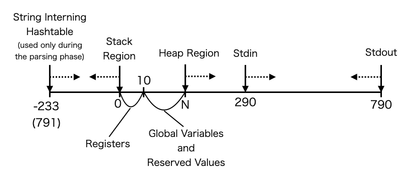

# Implementation Details
This file describes the implementation details for the various optimizations for the QFT assembly and the resulting Game of Life pattern.

## The C Compiler layer
- Added the computed goto feature to ELVM
  - This was merged into the original ELVM project.
- Modified the compiler to preserve and output memory address symbols and program address symbols, for their usage in the compiler optimization tool in the QFTASM layer
  - This allows to use [memheader.eir](./src/memheader.eir), so that symbols used in the C source can be referenced in the ELVM assembly layer using the same variable symbols.

## The ELVM Assembly layer
- Wrote the QFTASM backend for ELVM
  - This was merged into the original ELVM project.
- Added further improvements to the QFTASM backend:
  - Let the ELVM assembly's memory address space match QFT's native memory address space
    - Originally, the ELVM assembly had to convert its memory address every time when a memory access occurs.
  - Support new opcodes added in the improved QFT architecture

## The C layer (the implementation of the Lisp interpreter)
### Usage of binary search and hashtables for string representations and comparisons
By profiling the GCC-compiled version of the Lisp interpreter, it was found that the string table lookup process was a large performance bottleneck. This was a large room for optimization.

The optimized string lookup process is as follows.
First, when the Lisp parser accepts a symbol token, it creates a 4-bit hash of the string with the checksum of the ASCII representation of the string. The hash points to a hashtable that holds the root of a binary search tree for string comparison. Each node in the tree holds the string of the symbol token, and two nodes that are before and after the token in alphabetical order. When a query symbol token arrives in the parsing phase, a node with a matching token is returned, or a new node for the token is added into this binary tree if the token does not exist yet. This allows for each distinct symbol in the S-expression to have a distinct memory address.

In the interpretation phase, since each distinct symbol has a distinct memory address, and every string required for the Lisp program has already been parsed, string comparison can be done by simply comparing the memory address of the tokens. Since the interpreter only uses string equality operations for string comparison, simply checking for integer equality suffices for string comparison, speeding up the interpretation phase. Since the hash key is 4 bits long, this allows for reducing 4 searches in the binary tree compared to using a single binary tree.

### Usage of jump hash tables for the special form evaluation procedure searches
There are 17 distinct procedures for evaluating the special forms in the Lisp interpreter,
`define`, `if`, `quote`, `car`, `cdr`, `cons`, `atom`, `print`, `progn`, `while`, {`lambda`, `macro`}, `eval`, `eq`, {`+`, `-`, `*`, `/`, `mod`}, {`<`, `>`}, `list`, and lambda/macro invocations (when if the token is not a special form). Using an `if` statement to find the corresponding procedure for a given token becomes a linear search for the token comparisons. To speed up this search process, a hash table is created for jumping to the corresponding procedures. Since the memory addresses for the special forms can be determined before parsing the Lisp program, all of the symbols for the special forms have a fixed memory address. Therefore, the hash key can be created by subtracting an offset to the symbol's memory address, to point to a hashtable that is created near the register locations. This hashtable is provided in [memheader.eir](./src/memheader.eir). When the hash key is larger than the regions of this hashtable, it means that the symbol is not a special form, so the evaluation jumps to the lambda/macro invocation procedure.

### Usage of 2-bit headers to represent value types
The Lisp implementation has 3 distinct value types, `ATOM`, `INT`, and `LAMBDA`. Each value only consumes one QFT byte of memory; the `ATOM` value holds the pointer to the symbol's string hashtable, the `INT` value holds the signed integer value, and `LAMBDA` holds a pointer to the `Lambda` struct, as well as its subtype information, of either `LAMBDA`, `MACRO`, `TEMPLAMBDA` and `TEMPMACRO`. (The `TEMPLAMBDA` and `TEMPMACRO` subtypes are lambda and macro types that recycles its argument value memory space every time it is called, but is unused in the final lisp programs.) Since the RAM's address space is only 10 bits, there are 6 free bits that can be used for addresses holding pointers. Therefore, the value type and subtype information is held in these free bits. This makes the integer in the Lisp implementation to be a 14-bit signed integer, ranging from -8192 to 8191.

### Minimization of Stack Region Usage
Since the C compiler used in this project does not have memory optimization features, this has to be done manually within the C source code. This led to the largest reason why the interpreter's source code seems to be obfuscated.

One of the largest bottlenecks for memory access was stack region usage. Every time a stack region memory access occurs, the assembly code performs memory address offset operations to access the stack region. This does not happen when accessing the heap memory, since there is only one heap region used in the entire program, so the pointers for global variables can be hard-coded by the assembler. Therefore, it is favorable optimization-wise to use the heap memory as much as possible.

One way to make use of this fact is to use as much global variables as possible. Since registers and common RAM memory share the same memory space, global variables can be accessed with a speed comparable to registers (However, since the physical location of the RAM memory slot within the pattern affects the I/O signal arrival time, and the registers have the most smallest RAM addresses, i.e. they are the closest to the CPU unit, the registers have the fastest memory access time).

Another method of saving memory was to use union memory structures to minimize the stack region usage. In the C compiler used in this project, every time a new variable is introduced in a function, the function's stack region usage (used per call) is increased to fit all of the variables. This happens even when two variables never appear at the same time. Therefore, using the fact that some variables never appear simultaneously, unions are used for every occurence of such variables, so that they can use a shared region within the stack space. This led to minimization of the stack region usage. Since the stack region is only 233 hextets (1 byte in the QFT RAM is 16 bits) large, this allowed to increase the number of nested function calls, especially the nested calls of `eval` which evaluates the S-expressions. Since the S-expressions have a list structure, and `eval` becomes nested when lambdas are called in the Lisp program, this optimization was significant for allowing more sophisticated Lisp programs to be run in the architecture.

## The QFTASM layer
The QFT assembly generated by the C compiler has a lot of room for optimization. I therefore created a compiler optimization tool to reduce the QFTASM assembly size.

### Constant folding
Immediate constant expressions such as `ADD 1 2 destination` is folded to a `MOV` operation.

### `MOV` folding
The QFT assembly code can be splitted into subregions by jump operations, such that:

- Each subregion doesn't contain any jump operations
- Each subregion ends with a jump operation
- Every jump operation in the assembly is guaranteed to jump to the beginning of a subregion, and never to the middle of any subregion

The last guarantee where jumps never occur in the middle of a subregion is provided by the C compiler. The ELVM assembly's program counter is designed so that it increases only when a jump instruction appears. This makes an ELVM program counter to point to a sequence of multiple instructions, instead of a single instruction. Since the ELVM assembly uses the ELVM program counter for its jump instructions, it is guaranteed that the jump instructions in the QFT assembly never jump to the middle of any subregion, and always jumps to a beginning of a subregion.

In each subregion, the dependency graph for the memory address is created. If a memory address becomes written but is later overwritten without becoming used in that subregion at all, the instruction to write to that memory address is removed. Since it is guaranteed that jump operations never jump to the middle of any subregion, it is guaranteed that the overwritten values can be safely removed without affecting the outcome of the program. The `MOV` folding optimization makes use of this fact to remove unnecessary instructions.

This folding process is also done with dereferences; if a dereferenced memory address is written, and the address is overwritten without being used at all, and the dereference source is unoverwritten at all during this process, the instruction for writingto the dereferenced memory address is removed.

### Jump folding
If the destination of a conditional or fixed-destination jump instruction points to another jump instruction with a fixed destination, the jump destination is folded to the latter jump instruction's destination. 

A similar folding is done when a fixed jump instruction points to a conditional jump instruction, where the fixed jump instruction is replaced by the latter conditional jump instruction.

## The Varlife layer (the computer architecture)
### Created the with a lookup table structure for the ROM module
In [this image](./img/ss2.png) of the CPU and its surrounding modules, the two modules on the top are the ROM modules. The original ROM module had one table, with the memory address as the key and the instruction as the value. I recreated the ROM module to add a lookup table layer, where each distinct instruction (not the opcodes, but the entire instruction including the values used within) holds a distinct serial integer key. The ROM module on the right accepts a program counter address and returns the instruction key for the program counter. The module on the left accepts the instruction key and returns the actual bits of the instruction as the output. This allows for dictionary compression to be performed to the ROM data, saving a lot of space. Since the instructions are 45 bits and the instruction keys are only 10 bits, the instruction key table is 1/4 the size of the original ROM module. Although the ROM size is 3223 for the entire Lisp interpreter, there were only 616 distinct instructions in the Lisp interpreter, making the size of the instruction table be 616 ROM units high, effectively reducing the ROM module size altogether.

The ROM module features another form of compression, where absence of cells are used to represent 0-valued bits within the instruction. Below is a close-up look of the ROM value module:

Notice that some cells on the left are absent, despite the table being expected to be a rectangular shape. This is because absent cells do not emit any signals, hence effectively emitting 0-valued bits as the output. To use this fact, all of the instructions are first alphabetically ordered at table creation time, so that instructions that start with trailing zeroes become located higher in the table (further from the signal source). This allows for a maximum number of cells to be replaced with absent units to represent 0-valued bits. In fact, the instruction for no-ops is represented as all zeroes, so all of the units in the value module are replaced by absent cells. The no-op instruction appears a lot of times immediately after the jump operation, due to the fact that the QFT architecture has a branch delay when invoking a jump instruction, requiring a no-op instruction to be present to compensate for the delay.

### Added new optimized instructions to the ALU, and removed unused ones
I removed the `AND`, `OR`, `SL` (shift left), `SRL` (shift right logical), and the `SRA` (shift right arithmetical) opcodes, and added the `SRU` (shift right unit) and `SRE` (shift right eight) opcodes to the architecture. Since there already were opcodes for `XOR` (bitwise-xor) and `ANT` (bitwise-and-not), `AND` and `OR`, which were not used much in the interpreter, could be replaced by these opcodes. The bitshift operations had significantly larger patterns than the other opcodes, being more than 10 times larger than the other opcodes. These were reduced to a fixed-size shift operations which could be implemented in the same sizes as the other opcodes. Since the shift left opcode can be replaced by consecutively adding its own value, effectively multiplying by powers of 2, the opcode was safely removed. The main reason for the original bitshift units being large was due to the shift amounts being dependent on the values of the RAM. Converting a binary value to a physical (in-pattern) shift amount required a large pattern. On the other hand, shifting a fixed value could be implemented by a significantly more simpler pattern. The shift right eight instruction is mainly used for reading out the standard input, where each ASCII character in the input string is packed into one 16-bit RAM memory address.

This resulted in a total of exactly 8 opcodes, `ANT`, `XOR`, `SRE`, `SRU`, `SUB`, `ADD`, `MLZ`, and `MNZ`. Since this can fit in 3 bits, the opcode region for the instruction value was reduced by 1 bit. Since the RAM module is 10 bits, and the third value of the instruction is always the writing destination of the RAM, and the first instruction can also be made so that it becomes the reading source address of the RAM, this allows for an additional 6*2=12 bits to be reduced from the instruction length. These altogether has reduced the ROM word size from 58 to 45 bits, reducing nearly 1/4 of the original instruction size.

### Extended the ROM and RAM address space from 9,7-bit to 12,10-bit
The original QFT architecture had a ROM and RAM address space of 9 and 7 bits. I extended the ROM and RAM address space to 12 and 10 bits, respectively. This was not a straightforward task as it first seemed, since the signal arrival timings between the modules had to be carefully adjusted in order for the signals to line up correctly. This involved reverse-engineering and experimenting undocumented VarLife pattern units used in the original QFT architecture. The same held for when redesigning other parts of the architecture.

### Reducing the Standard Input Size
Since each byte of the RAM module can be ordered arbitrarily in the CPU's architecture, the RAM is arranged so that the standard output is written at the very bottom of the RAM module, and proceeds upwards. Therefore, the contents of the RAM can easily be observed in a Game of Life viewer by directly examining the bottom of the RAM module.

Since RAM has 16 bits of memory per memory address, it allows to fit two ASCII-encoded characters per one address. Therefore, the standard input is read out by reading two characters per address. For the standard output, one character is written to one address for aesthetic reasons, so that the characters can be directly observed in a Game of Life viewer the pattern more easily. Also, for the standard output to proceed upwards within the RAM module pattern, the memory pointer for the standard output proceeds backwards in the memory space, while the pointer for the standard input proceeds forwards in the memory space.

## The Game of Life layer
Optimizing the Game of Life layer mainly revolved around understanding the [Macrocell](https://www.conwaylife.com/wiki/Macrocell) format for representing and saving Game of Life patterns, and the [Hashlife](https://en.wikipedia.org/wiki/Hashlife) algorithm. The Macrocell format uses quadtrees and memoization for compressing repeated patterns. Since the final Game of Life pattern is an array of OTCA metapixels which are 2048x2048 large, and even has repeated patterns in the VarLife layer (meaning that there are repeated configurations of OTCA metapixels), this compression reduces the file size for the QFT pattern significantly. The best example that let me understand the Macrocell format was an example provided by Adam P. Goucher in [this thread](https://sourceforge.net/p/golly/mailman/golly-test/thread/983116CEB3464154AF26245F052EFB36%40adamspackard/) in Golly's mailing list.

The Hashlife algorithm also uses quadtrees and memoization to speed up the Game of Life simulations. This algorithm makes use of the fact that the same pattern in a same time frame influences only a fixed extent of its surrounding regions, hence allowing for memoization.

As for optimization, I first noticed that the QFT pattern had a 1-pixel high pattern concatenated to the entire pattern. The original QFT pattern in the original QFT repository was carefully designed so that it is composed of 8x8-sized pattern units. Therefore, most of the patterns can be represented by 8x8 tiles. However, since the 1-pixel high pattern at the top creates an offset that shifts away the pattern from this 8x8 grid, it causes the pattern to have fewer repeated patterns if interpreted from the corner of its bounding box, causing the memoization to work inefficiently. I therefore tried putting a redundant cell (which does not interfere with the rest of the pattern) to realign the entire pattern to its 8x8 grid, which actually slightly reduced the resulting Macrocell file size from the original one. Although I didn't compare the running times, since the Hashlife algorithm uses memoization over repeated patterns as well, I expect this optimization to at least slightly contribute to the performance of the simulation.

Another optimization was improving the metafier script used to convert VarLife patterns to Game of Life ([MetafierV3.py](https://github.com/woodrush/QFT-devkit/blob/main/MetafierV3.py)). The original script used a square region to fit the entire pattern to create the quadtree representation. However, since the Lisp in Life VarLife pattern is 968 pixels wide but 42354 pixels high, it tried to allocate a 65536x65536-sized integer array, which was prohibitively large to run. I modified the script so that it uses a rectangular region, where absent regions of the quadtree are represented as absent cells. Although this is very straightforward with the knowledge of the Macrocell format, it was difficult at first until I became fond of the algorithms surrounding the Game of Life.

## Memory Region Map and the Phases of Operation

The memory region map is carefully designed to save space. This is best described with the operation phases of the interpreter.

### Phase 0: Precalculations
Various precalculations are done after the interpreter starts running. The construction of the string interning hashtable for reserved atoms such as `define`, `quote`, etc. are done in this phase. For the GCC-compiled interpreter, some variables that are defined in the QFT memory header are defined in the C source.

Since the outcome of these precalculations are always the same for any incoming Lisp program, this phase is done on the host PC, and the results are saved as ramdump.csv during the QFTASM compile time. The results are then pre-loaded into the RAM when the VarLife and Game of Life patterns are created. This allows to saves some CPU cycles when running the interpreter.

As explained earlier, the QFT architecture holds register values in the RAM. There are 11 registers, which are placed in the addresses from 0 to 10.

The reserved values in the image include strings such as reserved atoms and the destinations of the jump hashtable used for evaluation. The rest of the region is used for storing global variables in the interpreter's C source code.

### Phase 1: Parsing
The Lisp program provided from the standard input is parsed into S-expressions, which is written into the heap region.

Notice that the string interning hashtables are created in the later end of the stack region. This is because these hashtables are only used during the parsing phase, and can be overwritten during the evaluation phase. For most Lisp programs including the ones in this repository, the stack region does not grow far enough to overwrite these values. This allows to place 3 growing memory regions during the parsing phase, the stack region used for nested S-expressions, the heap region which stores the parsed S-expressions, and the string interning hashtables when new strings are detected within the Lisp program. Newly detected strings such as variable names in the Lisp program are also written into the heap region.

The heap region is also designed so that it overwrites the standard input as it parses the program. Since older parts of the program can be discarded once it is parsed, this allows to naturally free the standard input region which save a lot of space after parsing. The standard input also gets overwritten by the Standard output if the output is long enough. However, due to this design, long programs may have trouble at parsing, since the input may be overwritten too far and get deleted before it is parsed. A workaround for this is to use indentation which places the program further ahead into the memory, which will prevent the program from being overwritten from the growing heap region. For all of the programs included in this repository, this is not an issue and the programs become successfully parsed.

### Phase 2: Evaluation
By this time, all of the contents of the stack region and what is ahead of the head of the heap region can be overwritten in the further steps. Note that a similar issue with the standard input happens with the standard output - when too many Lisp objects are created during runtime, it may overwrite the existing standard output, or may simply exceed the heap region and proceed into the stack region. Since the heap region is connected to the later end of the stack region, this may be safe if the standard output is carefully handled, but the interpreter will eventually start overwriting values of the stack region if the heap continues to grow.

## Miscellaneous
### How can a 2-state OTCA Metapixel emulate the behavior of an 8-state VarLife pattern?
This is one of the most interesting ideas in the original QFT project to make the QFT architecture possible. As explained in [the original QFT post](https://codegolf.stackexchange.com/questions/11880/build-a-working-game-of-tetris-in-conways-game-of-life/142673#142673), the 8 states of VarLife are actually a mixture of 4 different birth/survival rules with binary states. This means that each VarLife cell can only transition between two fixed states, and the birth/survival rule for that cell does not change at any point in time. Moreover, the OTCA Metapixel is designed so that each metapixel can carry its own birth/survival rules. Therefore, each VarLife cell can be enoded into an OTCA Metapixel by specifying its birth/survival rule and the binary state. This means that the array of OTCA Metapixels in the metafied pattern is actually a mixture of metapixels with different birth/survival rules, arranged in a way so that it makes the computation possible.

### Halting Time
After the program counter is set to 65535 and the program exits, no more ROM and RAM I/O signals become apparent in the entire module.
This makes the VarLife pattern becomes completely stationary, where every pattern henceforth becomes completely identical.
Defining this as the halting time for the calculation, the pattern for [print.lisp](./lisp/print.lisp) halts at exactly 105,413,068 VarLife generations.

The halting time for the Game of Life patterns are defined similarly for the meta-states of the OTCA Metapixels.
Since OTCA Metapixels never become stationary, the Game of Life states do not become stationary after the halting time,
but the meta-states of the OTCA Metapixels will become stationary after the halting time.

For the VarLife pattern of [print.lisp](./lisp/print.lisp), by generation 105,387,540, the value 65535 gets written to the program counter. At generation 105,413,067, the last signal becomes just one step from disappearing, and at generation 105,413,068 and onwards, the pattern becomes completely stationary and every pattern becomes identical to each other.
In the Game of Life version, since the OTCA Metapixel continues running indefinitely, the pattern does not become completly stationary, but the meta-states of the OTCA Metapixels will become completely stationary, since it is an emulation of the VarLife pattern.
Note that the halting times for programs other than print.lisp is just a sufficient number of generations, and not the exact values.

The required number of generations per CPU cycle depends on many factors such as the ROM and RAM addresses and the types of opcodes, since the arriving times of the I/O signals depend on factors such as these as well. This makes the number of generations required for the program to halt become different between each program.
For example, print.lisp has a rate of 23822.16 generations per CPU cycle (GpC), but z-combinator.lisp has a rate of 28870.81 GpC, and primes-print.lisp has 31502.43 GpC. 23822.16 GpC is in fact insufficient for z-combinator.lisp to finish running, and 28870.81 is also insufficient for primes-print.lisp to finish running.

### Miscellaneous Screenshots

The ALU unit in the CPU. From the left are the modules for the `ANT`, `XOR`, `SRE`, `SRU`, `SUB`, `ADD`, `MLZ`, and the `MNZ` opcodes.

The `SRE` and the `SRU` opcodes were newly added for this project.
